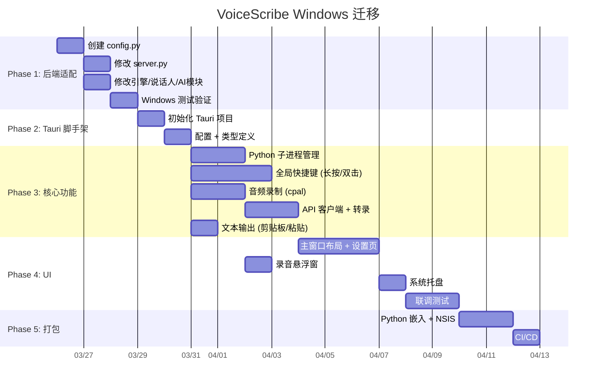

# VoiceScribe Windows 迁移改造计划

> 创建日期：2026-03-25
> 目标：将 macOS 原生应用迁移至 Windows，使用 Tauri 框架
> 用途：后续根据此文档生成 spec 文件

---

## 目录

- [总体策略](#总体策略)
- [Phase 1: 后端跨平台适配](#phase-1-后端跨平台适配)
- [Phase 2: Tauri 项目脚手架](#phase-2-tauri-项目脚手架)
- [Phase 3: 核心功能迁移](#phase-3-核心功能迁移)
- [Phase 4: UI 实现](#phase-4-ui-实现)
- [Phase 5: 构建与打包](#phase-5-构建与打包)
- [阶段依赖与排期](#阶段依赖与排期)
- [风险与缓解](#风险与缓解)

---

## 总体策略

### 核心原则

- **后端几乎不变**：Python FastAPI 后端仅做路径适配，API 接口保持不变
- **前端完全重写**：Swift → Tauri (Rust + React/TypeScript)
- **行为 100% 对齐**：长按/双击快捷键、输出模式、模型管理等行为与 macOS 版完全一致
- **模型目录迁移**：从 `~/Library/Application Support/VoiceScribe/models` 改为项目根目录下 `models/`

### macOS → Windows 技术映射总表

| macOS 技术 | 用于 | Windows/Tauri 替代方案 |
|---|---|---|
| SwiftUI | UI 框架 | React + TypeScript + Tailwind CSS |
| AVFoundation (`AVAudioRecorder`) | 录音 16kHz WAV | Rust `cpal` + `hound` crate |
| CGEventTap (`CFMachPort`) | 全局快捷键拦截 | Win32 `SetWindowsHookExW(WH_KEYBOARD_LL)` |
| CGEvent 键盘模拟 | 文本直接输入 | Rust `enigo` crate (`SendInput`) |
| NSPasteboard | 剪贴板 | `tauri-plugin-clipboard-manager` |
| MenuBarExtra | 菜单栏常驻图标 | Tauri 内置 `tray-icon` |
| AXIsProcessTrusted | 辅助功能权限检查 | 无需（Windows 无此限制） |
| NSProcess | Python 子进程管理 | Rust `std::process::Command` |
| NSWorkspace.frontmostApplication | 获取前台应用 | Win32 `GetForegroundWindow()` |
| Bundle.main.resourcePath | App Bundle 资源 | Tauri `app.path()` 资源目录 |
| @AppStorage (UserDefaults) | 持久化设置 | `tauri-plugin-store` (JSON 文件) |
| RecordingOverlayWindow (NSWindow) | 悬浮录音指示 | Tauri WebviewWindow (`always_on_top`, `decorations: false`) |
| Carbon keyCode (0=A, 15=R...) | 键码映射 | Windows Virtual Key Code (VK_A=0x41, VK_R=0x52...) |
| Info.plist 权限声明 | 麦克风/辅助功能权限 | `tauri.conf.json` + Windows 自动弹窗 |
| `/tmp/` | 临时文件 | `%TEMP%` / `std::env::temp_dir()` |
| `~/Library/Application Support/` | 应用数据 | `%APPDATA%` / Tauri `app_data_dir()` |

---

## Phase 1: 后端跨平台适配

### 1.1 新建 `backend/config.py` — 集中路径管理

**目的：** 用一个模块统一管理所有目录路径，替换散落在各文件中的硬编码 macOS 路径。

```python
# backend/config.py

import os
import sys
import shutil
from pathlib import Path
from typing import Optional

# ─── 项目根目录 ───
# server.py 所在目录的父目录
_BACKEND_DIR = Path(__file__).resolve().parent
PROJECT_ROOT = Path(os.environ.get("VOICESCRIBE_ROOT", str(_BACKEND_DIR.parent)))

# ─── 模型缓存目录 ───
MODEL_CACHE_DIR = Path(os.environ.get(
    "VOICESCRIBE_MODEL_DIR",
    str(PROJECT_ROOT / "models")
))
MODELSCOPE_CACHE = str(MODEL_CACHE_DIR)
MODEL_REGISTRY_PATH = MODEL_CACHE_DIR / "voicescribe_models.json"

# ─── Whisper.cpp ───
WHISPER_CPP_MODEL_DIR = Path(os.environ.get(
    "VOICESCRIBE_WHISPERCPP_MODEL_DIR",
    str(MODEL_CACHE_DIR / "whisper-cpp")
))

# ─── 说话人数据 ───
SPEAKER_DATA_DIR = Path(os.environ.get(
    "VOICESCRIBE_SPEAKER_DIR",
    str(PROJECT_ROOT / "data" / "speakers")
))

# ─── 配置目录 ───
CONFIG_DIR = Path(os.environ.get(
    "VOICESCRIBE_CONFIG_DIR",
    str(PROJECT_ROOT / "config")
))

def find_whisper_cli() -> Optional[str]:
    """跨平台查找 whisper-cli 可执行文件"""
    # 1. 环境变量
    env = os.environ.get("VOICESCRIBE_WHISPERCPP_CLI")
    if env and os.path.exists(env):
        return env
    # 2. PATH 搜索
    found = shutil.which("whisper-cli")
    if found:
        return found
    # 3. 平台特定路径
    if sys.platform == "darwin":
        for p in ["/opt/homebrew/bin/whisper-cli", "/usr/local/bin/whisper-cli"]:
            if os.path.exists(p):
                return p
    elif sys.platform == "win32":
        candidates = [
            Path.home() / "whisper.cpp" / "build" / "bin" / "Release" / "whisper-cli.exe",
            Path(os.environ.get("LOCALAPPDATA", "")) / "whisper-cpp" / "whisper-cli.exe",
        ]
        for p in candidates:
            if p.exists():
                return str(p)
    return None

def ensure_dirs():
    """确保所有必要目录存在"""
    for d in [MODEL_CACHE_DIR, WHISPER_CPP_MODEL_DIR, SPEAKER_DATA_DIR, CONFIG_DIR]:
        d.mkdir(parents=True, exist_ok=True)
```

**目录布局对比：**

| 用途 | macOS 旧路径 | 新路径（项目根目录相对） | 环境变量覆盖 |
|------|-------------|----------------------|-------------|
| 模型缓存 | `~/Library/Application Support/VoiceScribe/models` | `<ROOT>/models/` | `VOICESCRIBE_MODEL_DIR` |
| ModelScope 缓存 | 同上 | 同上 | `MODELSCOPE_CACHE` |
| 模型注册表 | 同上 `/voicescribe_models.json` | `<ROOT>/models/voicescribe_models.json` | — |
| Whisper.cpp 模型 | `~/.whisper-models/` | `<ROOT>/models/whisper-cpp/` | `VOICESCRIBE_WHISPERCPP_MODEL_DIR` |
| Whisper.cpp CLI | `/opt/homebrew/bin/whisper-cli` | `PATH` 搜索 + 平台回退 | `VOICESCRIBE_WHISPERCPP_CLI` |
| 说话人声纹 | `~/.voicescribe/speakers/` | `<ROOT>/data/speakers/` | `VOICESCRIBE_SPEAKER_DIR` |
| 配置文件 | `~/.voicescribe/` | `<ROOT>/config/` | `VOICESCRIBE_CONFIG_DIR` |
| 项目根目录 | — | `backend/` 的父目录 | `VOICESCRIBE_ROOT` |

---

### 1.2 修改 `backend/server.py`

#### 改动点 1：导入 config 模块（行 1-30 区域）

```python
# 新增导入
from config import (
    MODEL_CACHE_DIR, MODEL_REGISTRY_PATH, MODELSCOPE_CACHE,
    WHISPER_CPP_MODEL_DIR, find_whisper_cli, ensure_dirs,
)
```

#### 改动点 2：whisper.cpp 检测函数（行 37-45）

**当前代码：**
```python
def _whispercpp_cli_available() -> bool:
    return os.path.exists("/opt/homebrew/bin/whisper-cli")  # ← 硬编码 macOS 路径

def _whispercpp_model_available() -> bool:
    model_path = os.path.expanduser("~/.whisper-models/ggml-base.bin")  # ← 硬编码
    return os.path.exists(model_path)
```

**改为：**
```python
def _whispercpp_cli_available() -> bool:
    return find_whisper_cli() is not None

def _whispercpp_model_available() -> bool:
    return (WHISPER_CPP_MODEL_DIR / "ggml-base.bin").exists()
```

#### 改动点 3：MODEL_CACHE_DIR 初始化（行 88-99）

**当前代码：**
```python
MODEL_CACHE_DIR = os.environ.get("VOICESCRIBE_MODEL_DIR")
if not MODEL_CACHE_DIR:
    MODEL_CACHE_DIR = os.path.join(
        Path.home(), "Library", "Application Support", "VoiceScribe", "models"
    )
os.environ.setdefault("MODELSCOPE_CACHE", MODEL_CACHE_DIR)
os.makedirs(MODEL_CACHE_DIR, exist_ok=True)
MODEL_REGISTRY_PATH = os.path.join(MODEL_CACHE_DIR, "voicescribe_models.json")
```

**改为：**
```python
# 已在顶部从 config 导入 MODEL_CACHE_DIR, MODEL_REGISTRY_PATH, MODELSCOPE_CACHE
os.environ.setdefault("MODELSCOPE_CACHE", str(MODELSCOPE_CACHE))
ensure_dirs()
```

删除原有的 `MODEL_CACHE_DIR`、`MODEL_REGISTRY_PATH` 局部定义，全部使用 config 模块导出的值。

#### 改动点 4：/load 端点中的 whisper.cpp 模型路径（行 448）

**当前代码：**
```python
model_path = os.path.expanduser(f"~/.whisper-models/ggml-{model}.bin")
```

**改为：**
```python
model_path = str(WHISPER_CPP_MODEL_DIR / f"ggml-{model}.bin")
```

#### 改动点 5：FunASR 下载的 cache_dir（行 366）

**当前代码：**
```python
local_dir = await asyncio.to_thread(
    snapshot_download, model_id, cache_dir=MODEL_CACHE_DIR
)
```

**改为：**
```python
local_dir = await asyncio.to_thread(
    snapshot_download, model_id, cache_dir=str(MODEL_CACHE_DIR)
)
```

确保传入字符串类型（`snapshot_download` 可能不接受 `Path` 对象）。

---

### 1.3 修改 `backend/engines/whispercpp_engine.py`

#### 改动点 1：默认模型路径（行 33）

**当前：** `os.path.expanduser("~/.whisper-models/ggml-base.bin")`
**改为：**
```python
from config import WHISPER_CPP_MODEL_DIR
# 在 __init__ 中:
if model_path is None:
    model_path = str(WHISPER_CPP_MODEL_DIR / "ggml-base.bin")
```

#### 改动点 2：whisper-cli 路径（行 37）

**当前：** `self.whisper_cli = "/opt/homebrew/bin/whisper-cli"`
**改为：**
```python
from config import find_whisper_cli
# 在 __init__ 中:
self.whisper_cli = find_whisper_cli()
if self.whisper_cli is None:
    raise FileNotFoundError("whisper-cli not found. Install whisper.cpp or set VOICESCRIBE_WHISPERCPP_CLI")
```

---

### 1.4 修改 `backend/diarization/speaker.py`

#### 改动点：默认数据目录（行 18）

**当前：**
```python
def __init__(self, data_dir: str = "~/.voicescribe/speakers"):
```

**改为：**
```python
from config import SPEAKER_DATA_DIR

def __init__(self, data_dir: str = None):
    if data_dir is None:
        data_dir = str(SPEAKER_DATA_DIR)
    self.data_dir = Path(data_dir).expanduser()
    self.data_dir.mkdir(parents=True, exist_ok=True)
```

---

### 1.5 修改 `backend/postprocess/ai_refiner.py`

#### 改动点：配置目录（行 36-37）

**当前：**
```python
self.config_dir = Path.home() / ".voicescribe"
self.prompt_file = self.config_dir / "refine_prompt.txt"
```

**改为：**
```python
from config import CONFIG_DIR

self.config_dir = CONFIG_DIR
self.prompt_file = self.config_dir / "refine_prompt.txt"
```

---

### 1.6 向后兼容性保证

| 场景 | 行为 |
|------|------|
| macOS 原生 app（BackendManager 设置 `VOICESCRIBE_MODEL_DIR`） | 环境变量优先，继续使用 `~/Library/Application Support/` |
| Windows Tauri 不设置环境变量 | 自动使用 `<项目根>/models/` |
| 开发者手动运行 `python server.py` | 自动使用 `<项目根>/models/` |
| 设置 `VOICESCRIBE_ROOT` | 所有路径基于该目录 |

### 1.7 Phase 1 测试方案

```bash
# Windows 上验证后端启动
cd backend
python -m venv venv
venv\Scripts\activate
pip install -r requirements-minimal.txt
python server.py --mock

# 验证点：
# 1. 启动无报错
# 2. GET http://127.0.0.1:8765/ 返回 status: ok
# 3. GET http://127.0.0.1:8765/engines 返回引擎列表
# 4. models/ 目录被自动创建
# 5. config/ 目录被自动创建
# 6. data/speakers/ 目录被自动创建
```

---

## Phase 2: Tauri 项目脚手架

### 2.1 技术选型

| 决策点 | 选择 | 理由 |
|--------|------|------|
| 前端框架 | **React 18 + TypeScript** | 生态最大，Tauri 集成最成熟 |
| 样式方案 | **Tailwind CSS 3** | 原子化 CSS，适合深色主题 |
| UI 组件库 | **Radix UI** | 无样式原语，完全可定制 |
| 状态管理 | **Zustand** | 轻量，模式与 AppState 单例一致 |
| 构建工具 | **Vite 5** | Tauri v2 默认，HMR 快速 |
| 音频录制 | **Rust `cpal` + `hound`** | 原生 Windows WASAPI 支持，16kHz WAV |
| 全局快捷键 | **Win32 低级键盘钩子** | 支持 keydown/keyup 事件（长按检测需要） |
| 剪贴板 | **`tauri-plugin-clipboard-manager`** | Tauri 官方插件 |
| 系统托盘 | **Tauri v2 内置 `tray-icon`** | 一等公民支持 |
| 文本输入模拟 | **Rust `enigo` crate** | 跨平台 `SendInput` 封装 |
| 持久化存储 | **`tauri-plugin-store`** | JSON 文件，替代 `@AppStorage` |
| HTTP 客户端 | **Rust `reqwest`**（转录用） + **前端 `fetch`**（轻量查询用） | 转录上传二进制文件走 Rust 避免 IPC 开销 |

### 2.2 项目结构

```
voicescribe/
├── backend/                          # Python 后端（Phase 1 适配后）
│   ├── config.py                     # [新建] 集中路径管理
│   ├── server.py
│   ├── engines/
│   ├── diarization/
│   └── postprocess/
│
├── models/                           # [新建] 模型缓存目录
│   └── voicescribe_models.json
│
├── data/                             # [新建] 运行时数据
│   └── speakers/                     # 声纹数据
│
├── config/                           # [新建] 用户配置
│   └── refine_prompt.txt             # AI refiner 自定义 prompt
│
├── tauri-app/                        # [新建] Tauri 前端项目
│   ├── src-tauri/                    # Rust 后端
│   │   ├── Cargo.toml
│   │   ├── tauri.conf.json
│   │   ├── build.rs
│   │   ├── icons/
│   │   │   ├── icon.ico
│   │   │   └── icon.png
│   │   └── src/
│   │       ├── main.rs               # Tauri 入口
│   │       ├── lib.rs                 # 模块声明
│   │       ├── state.rs               # 共享状态（Mutex<AppState>）
│   │       └── commands/
│   │           ├── mod.rs
│   │           ├── backend.rs         # Python 子进程管理
│   │           ├── audio.rs           # 音频录制（cpal）
│   │           ├── hotkey.rs          # 全局快捷键 + 长按/双击逻辑
│   │           └── text_input.rs      # 文本输出（剪贴板 + 粘贴模拟）
│   │
│   ├── src/                           # React 前端
│   │   ├── main.tsx                   # React 入口
│   │   ├── App.tsx                    # 根组件 + 路由
│   │   ├── api/
│   │   │   ├── backend.ts            # FastAPI HTTP 客户端
│   │   │   └── tauri.ts              # Tauri invoke 封装
│   │   ├── stores/
│   │   │   ├── appStore.ts           # Zustand 主状态
│   │   │   └── modelStore.ts         # 模型管理状态
│   │   ├── components/
│   │   │   ├── Layout.tsx            # 侧边栏布局
│   │   │   ├── ConnectionStatus.tsx  # 连接状态指示
│   │   │   ├── RecordingOverlay.tsx  # 悬浮录音指示（独立窗口内容）
│   │   │   └── Toast.tsx             # 提示条
│   │   ├── pages/
│   │   │   ├── GeneralSettings.tsx   # 通用设置
│   │   │   ├── EngineSettings.tsx    # 引擎/模型管理
│   │   │   ├── VocabularySettings.tsx # 热词管理
│   │   │   ├── SpeakerSettings.tsx   # 说话人管理
│   │   │   └── HotkeySettings.tsx    # 快捷键设置
│   │   ├── hooks/
│   │   │   ├── useBackendConnection.ts
│   │   │   ├── useRecording.ts
│   │   │   └── useHotkey.ts
│   │   ├── types/
│   │   │   └── index.ts              # TypeScript 类型定义
│   │   └── styles/
│   │       └── globals.css            # Tailwind 全局样式
│   │
│   ├── overlay.html                   # 录音悬浮窗入口 HTML
│   ├── index.html                     # 主窗口入口 HTML
│   ├── package.json
│   ├── tsconfig.json
│   ├── vite.config.ts
│   └── tailwind.config.js
│
├── app/                               # [保留] macOS 原生前端
├── docs/                              # 文档
└── scripts/                           # 脚本
```

### 2.3 `tauri.conf.json` 关键配置

```json
{
  "$schema": "https://raw.githubusercontent.com/nicovrc/tauri-v2-schema/refs/heads/main/schema.json",
  "productName": "VoiceScribe",
  "version": "0.2.0",
  "identifier": "com.voicescribe.app",
  "build": {
    "frontendDist": "../dist",
    "devUrl": "http://localhost:5173",
    "beforeBuildCommand": "npm run build",
    "beforeDevCommand": "npm run dev"
  },
  "app": {
    "windows": [
      {
        "label": "main",
        "title": "VoiceScribe",
        "width": 700,
        "height": 450,
        "resizable": true,
        "center": true,
        "visible": true
      }
    ],
    "trayIcon": {
      "id": "main-tray",
      "iconPath": "icons/icon.png",
      "tooltip": "VoiceScribe"
    },
    "security": {
      "csp": "default-src 'self'; connect-src 'self' http://127.0.0.1:8765"
    }
  },
  "bundle": {
    "active": true,
    "targets": ["nsis"],
    "icon": ["icons/icon.ico", "icons/icon.png"],
    "resources": ["../../backend/**/*"],
    "windows": {
      "nsis": {
        "installMode": "perMachine",
        "languages": ["SimpChinese", "English"]
      }
    }
  },
  "plugins": {
    "global-shortcut": {},
    "clipboard-manager": {},
    "store": {}
  }
}
```

### 2.4 Rust 依赖 `Cargo.toml`

```toml
[dependencies]
tauri = { version = "2", features = ["tray-icon"] }
tauri-plugin-global-shortcut = "2"
tauri-plugin-clipboard-manager = "2"
tauri-plugin-store = "2"
serde = { version = "1", features = ["derive"] }
serde_json = "1"
tokio = { version = "1", features = ["full"] }
reqwest = { version = "0.12", features = ["multipart", "json"] }
cpal = "0.15"
hound = "3.5"
enigo = "0.2"
parking_lot = "0.12"

[target.'cfg(windows)'.dependencies]
windows = { version = "0.58", features = [
    "Win32_UI_WindowsAndMessaging",
    "Win32_Foundation",
    "Win32_System_LibraryLoader",
] }
```

### 2.5 TypeScript 类型定义 (`src/types/index.ts`)

对齐 `AppState.swift` 和 `BackendService.swift` 的数据结构：

```typescript
// ─── 引擎信息（对应 EngineInfo struct） ───
export interface EngineInfo {
  name: string;          // "whisper" | "funasr" | "whispercpp" | "parakeet"
  models: string[];
  loaded_model: string | null;
  available: boolean;
}

// ─── 转录结果（对应 TranscribeResult struct） ───
export interface TranscribeResult {
  text: string;
  segments: Segment[];
  duration: number;
  engine: string;
  model: string;
}

export interface Segment {
  start: number;
  end: number;
  text: string;
  speaker?: string;
}

// ─── 转录历史（对应 Transcription struct） ───
export interface Transcription {
  id: string;
  date: string;
  duration: number;
  text: string;
  segments: Segment[];
  engine: string;
  model: string;
  audioPath?: string;
}

// ─── 模型状态（对应 ModelStatusInfo struct） ───
export interface ModelStatus {
  engine: string;
  model: string;
  available: boolean;
  downloading: boolean;
  size_bytes: number | null;
  downloaded_bytes: number | null;
  error: string | null;
}

// ─── 说话人（对应 SpeakerInfo struct） ───
export interface SpeakerInfo {
  speaker_id: string;
  name: string;
}

// ─── 应用状态（对应 AppState 的 @AppStorage 字段） ───
export interface AppSettings {
  selectedEngine: string;       // 默认 "funasr"
  selectedModel: string;        // 默认 "seaco-paraformer"
  language: string;             // 默认 "zh"
  enableDiarization: boolean;   // 默认 false
  hotkeyModifiers: number;      // 默认 Ctrl+Shift (Windows)
  hotkeyKeyCode: number;        // 默认 VK_R (0x52)
  outputMode: string;           // "directInput" | "clipboard" | "both"
  hotwords: string;             // 逗号分隔
  enableAIRefine: boolean;      // 默认 false
}

// ─── 录音状态 ───
export interface RecordingStatus {
  isRecording: boolean;
  duration: number;
  audioLevel: number;
}

// ─── 后端状态 ───
export interface BackendStatus {
  running: boolean;
  message: string;
}
```

---

## Phase 3: 核心功能迁移

### 3.1 Python 子进程管理 (`src-tauri/src/commands/backend.rs`)

**对应 macOS 代码：** `BackendManager.swift`（行 34-490）

#### 核心行为复制

| 行为 | macOS 实现 | Tauri 实现 |
|------|-----------|-----------|
| 查找 Python | `findPython()` 搜索 venv/bin, homebrew, system | 搜索 `venv\Scripts\python.exe`, 系统 PATH |
| 查找后端 | `findBackendPath()` 搜索 bundle, 相对路径 | 搜索 Tauri 资源目录, 相对路径 |
| 启动进程 | `Process.run()` + `Pipe` 捕获输出 | `Command::new().spawn()` + stdout/stderr 管道 |
| 检测就绪 | 监听 "Uvicorn running" 输出 | 同样监听 stdout 关键字 |
| 健康检查 | HTTP GET `/health` | `reqwest::get()` |
| 停止进程 | `process.terminate()` + `SIGKILL` 超时 | `child.kill()` (Windows `TerminateProcess`) |
| 依赖安装 | `runCommand(pip install...)` | `Command::new("pip").args(...)` |

#### Python 查找逻辑（Windows 版）

```
优先级：
1. <项目根>/backend/venv/Scripts/python.exe   ← venv（Windows）
2. <项目根>/backend/venv/bin/python3          ← venv（macOS/Linux）
3. Tauri 资源目录/python-embed/python.exe     ← 嵌入式 Python
4. 系统 PATH 中的 python.exe / python3        ← 系统 Python
```

#### 环境变量设置

```rust
let mut cmd = Command::new(python_path);
cmd.current_dir(&backend_dir);
cmd.arg("server.py");
cmd.env("PYTHONUNBUFFERED", "1");
cmd.env("VOICESCRIBE_MODEL_DIR", &model_dir);  // <ROOT>/models
cmd.env("MODELSCOPE_CACHE", &model_dir);

// Windows 特有：隐藏控制台窗口
#[cfg(windows)]
{
    use std::os::windows::process::CommandExt;
    cmd.creation_flags(0x08000000); // CREATE_NO_WINDOW
}
```

#### Tauri Commands 暴露给前端

```rust
#[tauri::command]
async fn start_backend(app: AppHandle) -> Result<(), String>;

#[tauri::command]
async fn stop_backend(app: AppHandle) -> Result<(), String>;

#[tauri::command]
async fn get_backend_status(app: AppHandle) -> Result<BackendStatus, String>;

#[tauri::command]
async fn install_dependencies(app: AppHandle) -> Result<(), String>;
```

#### 事件推送（替代 @Published）

```rust
// Rust 端发送事件
app.emit("backend-status", BackendStatus { running: true, message: "运行中" });
app.emit("backend-log", log_line);

// 前端监听
import { listen } from "@tauri-apps/api/event";
listen<BackendStatus>("backend-status", (event) => { ... });
```

---

### 3.2 全局快捷键 (`src-tauri/src/commands/hotkey.rs`)

**对应 macOS 代码：** `HotkeyManager.swift`（行 40-509）

#### 为什么不用 `tauri-plugin-global-shortcut`

`tauri-plugin-global-shortcut` 只触发 keydown 事件，**不支持 keyup**。VoiceScribe 的长按模式需要检测 keyup 来停止录音，因此必须使用 Win32 低级键盘钩子。

#### Windows 低级键盘钩子实现

```rust
use windows::Win32::UI::WindowsAndMessaging::*;
use windows::Win32::Foundation::*;

static HOOK: OnceLock<Mutex<HotkeyState>> = OnceLock::new();

struct HotkeyState {
    target_vk: u32,              // 目标键 Virtual Key Code
    target_modifiers: u32,       // MOD_CONTROL | MOD_SHIFT | MOD_ALT
    last_press_time: Option<Instant>,
    is_pressed: bool,
    is_long_press_mode: bool,
    double_tap_threshold: Duration,  // 350ms
    app_handle: Option<AppHandle>,
}

unsafe extern "system" fn keyboard_hook_proc(
    code: i32,
    wparam: WPARAM,
    lparam: LPARAM,
) -> LRESULT {
    if code >= 0 {
        let kb = *(lparam.0 as *const KBDLLHOOKSTRUCT);
        let vk = kb.vkCode;

        // ESC 键取消录音
        if wparam.0 as u32 == WM_KEYDOWN && vk == VK_ESCAPE.0 as u32 {
            if is_recording() {
                emit_event("hotkey-cancel");
                return LRESULT(1); // 消费事件
            }
        }

        // 匹配目标快捷键
        if matches_hotkey(vk) {
            match wparam.0 as u32 {
                WM_KEYDOWN | WM_SYSKEYDOWN => {
                    if !kb.flags.contains(LLKHF_INJECTED) {
                        handle_key_down();
                        return LRESULT(1);
                    }
                }
                WM_KEYUP | WM_SYSKEYUP => {
                    handle_key_up();
                    return LRESULT(1);
                }
                _ => {}
            }
        }
    }
    CallNextHookEx(HHOOK::default(), code, wparam, lparam)
}
```

#### 长按/双击时序逻辑（精确对齐 Swift 版）

```
                     按下
                      │
          ┌───────────▼───────────┐
          │ 距上次按下 < 350ms?    │
          └───┬───────────────┬───┘
              │ YES           │ NO
              ▼               ▼
        【双击检测】      记录时间戳
        取消 350ms 定时器   启动 350ms 定时器
              │               │
              ▼               │ 定时器到期
        正在录音?             ▼
        ├── YES → 停止录音 + 转录  开始录音（长按模式）
        └── NO  → 开始录音         │
                                  │ 释放按键
                                  ▼
                            正在录音 + 长按模式?
                            ├── YES → 停止录音 + 转录
                            └── NO  → 无操作
```

**事件通知到前端：**
```rust
app.emit("hotkey-start-recording", ());     // 开始录音
app.emit("hotkey-stop-recording", ());      // 停止录音并转录
app.emit("hotkey-cancel", ());              // ESC 取消
```

#### 修饰键映射

| macOS 修饰键 | 掩码值 | Windows 等价键 | VK 码 |
|---|---|---|---|
| ⌘ Command | 0x100000 | Ctrl | VK_CONTROL (MOD_CONTROL) |
| ⇧ Shift | 0x020000 | Shift | VK_SHIFT (MOD_SHIFT) |
| ⌥ Option | 0x080000 | Alt | VK_MENU (MOD_ALT) |
| ⌃ Control | 0x040000 | Win | VK_LWIN (MOD_WIN) |

**默认快捷键：** macOS `⌘⇧R` → Windows `Ctrl+Shift+R`

#### Tauri Commands

```rust
#[tauri::command]
fn register_hotkey(modifiers: u32, key_code: u32) -> Result<(), String>;

#[tauri::command]
fn unregister_hotkey() -> Result<(), String>;

#[tauri::command]
fn get_hotkey_display() -> Result<String, String>;
```

---

### 3.3 音频录制 (`src-tauri/src/commands/audio.rs`)

**对应 macOS 代码：** `AudioRecorder.swift`（行 6-164）

#### 录音参数（必须与 macOS 版一致）

| 参数 | 值 | 说明 |
|------|----|------|
| 采样率 | **16000** Hz | ASR 模型标准输入 |
| 声道数 | **1**（单声道） | 减少文件大小 |
| 位深 | **16** bit | 有符号整数 |
| 格式 | **WAV (PCM)** | 无压缩 |
| 字节序 | Little-endian | WAV 标准 |

#### 实现要点

```rust
use cpal::traits::{DeviceTrait, HostTrait, StreamTrait};
use hound::{WavSpec, WavWriter};

struct AudioRecorder {
    stream: Option<cpal::Stream>,
    writer: Option<Arc<Mutex<WavWriter<BufWriter<File>>>>>,
    recording_path: Option<PathBuf>,
    start_time: Option<Instant>,
    is_recording: AtomicBool,
    audio_level: AtomicU32,  // f32 as bits
}

impl AudioRecorder {
    fn start(&mut self) -> Result<PathBuf, String> {
        let host = cpal::default_host();
        let device = host.default_input_device()
            .ok_or("No input device")?;

        // 配置 16kHz 单声道
        let config = cpal::StreamConfig {
            channels: 1,
            sample_rate: cpal::SampleRate(16000),
            buffer_size: cpal::BufferSize::Default,
        };

        let spec = WavSpec {
            channels: 1,
            sample_rate: 16000,
            bits_per_sample: 16,
            sample_format: hound::SampleFormat::Int,
        };

        // 输出到临时文件
        let path = std::env::temp_dir()
            .join(format!("recording_{}.wav", timestamp()));
        let writer = WavWriter::create(&path, spec)?;
        // ...
    }
}
```

#### 音量监测

macOS 版通过 `AVAudioRecorder.averagePower(forChannel:)` 获取分贝值，转换公式：
```
audioLevel = max(0, min(1, (db + 60) / 60))
```

Rust 版通过 cpal 回调计算 RMS：
```rust
// 在 cpal 数据回调中：
let rms = (samples.iter().map(|&s| (s as f64).powi(2)).sum::<f64>()
    / samples.len() as f64).sqrt();
let db = 20.0 * (rms / 32768.0).log10();
let level = ((db + 60.0) / 60.0).clamp(0.0, 1.0);
```

通过 Tauri 事件实时推送：
```rust
app.emit("audio-level", level as f32);
```

#### Tauri Commands

```rust
#[tauri::command]
fn start_recording() -> Result<String, String>;   // 返回临时文件路径

#[tauri::command]
fn stop_recording() -> Result<String, String>;    // 返回录音文件路径

#[tauri::command]
fn cancel_recording() -> Result<(), String>;      // 删除临时文件

#[tauri::command]
fn get_recording_status() -> RecordingStatus;     // {is_recording, duration, audio_level}
```

---

### 3.4 后端 API 客户端

#### Rust 端（重请求走 Rust，避免 IPC 二进制开销）

```rust
// src-tauri/src/commands/backend.rs 中添加

#[tauri::command]
async fn transcribe(
    audio_path: String,
    engine: String,
    model: String,
    language: String,
    enable_diarization: bool,
    hotwords: String,
    enable_ai_refine: bool,
) -> Result<TranscribeResult, String> {
    let client = reqwest::Client::new();
    let file = tokio::fs::read(&audio_path).await.map_err(|e| e.to_string())?;

    let form = reqwest::multipart::Form::new()
        .part("audio", reqwest::multipart::Part::bytes(file).file_name("recording.wav"))
        .text("engine", engine)
        .text("model", model)
        .text("language", language)
        .text("enable_diarization", enable_diarization.to_string())
        .text("hotwords", hotwords)
        .text("enable_ai_refine", enable_ai_refine.to_string());

    let resp = client
        .post("http://127.0.0.1:8765/transcribe")
        .multipart(form)
        .timeout(Duration::from_secs(300))  // 5 分钟超时
        .send()
        .await
        .map_err(|e| e.to_string())?;

    resp.json::<TranscribeResult>().await.map_err(|e| e.to_string())
}
```

**重试机制：** 对齐 macOS 版（最多 30 次，每次间隔 2 秒），在 Rust 端实现。

#### 前端 TypeScript 端（轻量查询直接用 fetch）

```typescript
// src/api/backend.ts
const BASE_URL = "http://127.0.0.1:8765";

export async function listEngines(): Promise<EngineInfo[]> {
  const resp = await fetch(`${BASE_URL}/engines`);
  return resp.json();
}

export async function loadEngine(engine: string, model: string): Promise<void> {
  await fetch(`${BASE_URL}/load`, {
    method: "POST",
    headers: { "Content-Type": "application/x-www-form-urlencoded" },
    body: `engine=${engine}&model=${model}`,
  });
}

export async function healthCheck(): Promise<boolean> {
  try {
    const resp = await fetch(`${BASE_URL}/health`);
    return resp.ok;
  } catch {
    return false;
  }
}

// ... listModels, downloadModel, deleteModel, listSpeakers, etc.
```

---

### 3.5 文本输出 (`src-tauri/src/commands/text_input.rs`)

**对应 macOS 代码：** `TextInputService.swift`（行 6-94）+ `HotkeyManager.swift`（行 482-508）

#### 输出模式

| 模式 | macOS 实现 | Windows 实现 |
|------|-----------|-------------|
| `clipboard` | `NSPasteboard.general.setString()` | `tauri-plugin-clipboard-manager` |
| `directInput` | 激活 previousApp + CGEvent ⌘V | `SetForegroundWindow` + `enigo` Ctrl+V |
| `both` | 两者都执行 | 两者都执行 |

#### "前台应用" 追踪

```rust
use windows::Win32::UI::WindowsAndMessaging::{GetForegroundWindow, SetForegroundWindow};

// 录音开始前保存
let previous_hwnd = unsafe { GetForegroundWindow() };

// 转录完成后恢复
unsafe { SetForegroundWindow(previous_hwnd); }
std::thread::sleep(Duration::from_millis(200));  // 等待窗口激活

// 模拟 Ctrl+V
let mut enigo = Enigo::new(&Settings::default()).unwrap();
enigo.key(Key::Control, Direction::Press).unwrap();
enigo.key(Key::Unicode('v'), Direction::Click).unwrap();
enigo.key(Key::Control, Direction::Release).unwrap();
```

#### 特殊情况处理

对齐 macOS 版：如果 previousApp 是 VoiceScribe 本身，强制使用 clipboard 模式。

```rust
// 检查前台窗口是否是自己
let is_self = unsafe {
    let hwnd = GetForegroundWindow();
    let mut pid = 0u32;
    GetWindowThreadProcessId(hwnd, Some(&mut pid));
    pid == std::process::id()
};
if is_self {
    output_mode = "clipboard";
}
```

---

## Phase 4: UI 实现

### 4.1 主窗口 — 设置页（侧边栏导航）

**对应 macOS 代码：** `ContentView.swift`, `SettingsView.swift`

#### 布局结构

```
┌──────────────────────────────────────────────┐
│ ● VoiceScribe              ◉ 已连接  ─ □ ✕ │
├─────────────┬────────────────────────────────┤
│             │                                │
│  ⚙ 通用    │   [当前选中页面的内容]          │
│  🔧 引擎    │                                │
│  📝 热词    │                                │
│  👤 说话人  │                                │
│  ⌨ 快捷键  │                                │
│             │                                │
│             │                                │
│             │                                │
├─────────────┴────────────────────────────────┤
│  VoiceScribe v0.2.0                          │
└──────────────────────────────────────────────┘
```

#### 各页面字段（对应 `AppState.swift` 的 `@AppStorage`）

**通用设置 (`GeneralSettings.tsx`)：**

| 字段 | 组件 | 选项 | 默认值 |
|------|------|------|--------|
| 语言 | Select | zh / en / ja / ko / auto | zh |
| 输出方式 | Radio | 直接输入 / 剪贴板 / 两者 | directInput |
| 说话人识别 | Switch | on/off | off |
| AI 文本优化 | Switch | on/off | off |
| 后端状态 | 状态指示 | 运行中(绿) / 启动中(黄) / 未连接(红) | — |

**引擎设置 (`EngineSettings.tsx`)：**

| 字段 | 组件 | 说明 |
|------|------|------|
| 引擎选择 | Select | 仅显示 available=true 的引擎 |
| 模型选择 | Select | 根据引擎动态切换选项 |
| 加载模型 | Button | POST /load |
| 模型管理 | 列表 | FunASR 模型的下载/删除/进度 |

**热词设置 (`VocabularySettings.tsx`)：**

| 字段 | 组件 | 说明 |
|------|------|------|
| 热词输入 | TagInput | 逗号分隔，flow 布局标签 |
| 说明文本 | Text | 解释热词用法和格式 |

**说话人管理 (`SpeakerSettings.tsx`)：**

| 字段 | 组件 | 说明 |
|------|------|------|
| 说话人列表 | List | 显示已注册的说话人 + 删除按钮 |
| 注册新说话人 | Form | 名称输入 + 录音按钮 + 音量指示 |

**快捷键设置 (`HotkeySettings.tsx`)：**

| 字段 | 组件 | 说明 |
|------|------|------|
| 修饰键 | Checkboxes | Ctrl / Shift / Alt / Win |
| 主键 | Select | A-Z, 0-9, F1-F12 等 |
| 预览 | Text | "Ctrl+Shift+R" |
| 应用 | Button | 重新注册快捷键 |

### 4.2 录音悬浮窗

**对应 macOS 代码：** `RecordingOverlayWindow.swift`

独立 Tauri 窗口，在 Rust 端动态创建：

```rust
fn show_overlay(app: &AppHandle) {
    let overlay = tauri::WebviewWindowBuilder::new(
        app,
        "overlay",
        tauri::WebviewUrl::App("overlay.html".into()),
    )
    .title("Recording")
    .inner_size(200.0, 60.0)
    .position(/* 屏幕底部居中 */)
    .decorations(false)
    .transparent(true)
    .always_on_top(true)
    .skip_taskbar(true)
    .resizable(false)
    .focused(false)       // 不抢焦点
    .build()
    .unwrap();
}
```

**三种视觉状态：**

| 状态 | 显示内容 | 对应 macOS 视图 |
|------|---------|----------------|
| 录音中 | 红色脉动圆点 + 声波动画 + 时长 MM:SS | RecordingOverlayView isRecording=true |
| 转录中 | "正在转录..." + 跳动省略号动画 | RecordingOverlayView isTranscribing=true |
| 已取消 | 橙色 ✕ + "已取消"（1 秒后消失） | RecordingOverlayView recordingCancelled=true |

### 4.3 系统托盘

```rust
let menu = MenuBuilder::new(app)
    .text("toggle", "开始录音")          // 录音中变为 "停止录音"
    .separator()
    .text("recent", "最近: (无)")        // 显示最近转录前 30 字
    .text("copy", "复制最近结果")
    .separator()
    .text("settings", "设置...")
    .text("show", "打开主窗口")
    .separator()
    .text("quit", "退出")
    .build()?;

// 图标切换
tray.set_icon(if is_recording { "mic_recording.png" } else { "mic_idle.png" });
```

**托盘行为：**
- 左键单击：显示/隐藏主窗口
- 右键：弹出菜单
- 关闭主窗口：最小化到托盘（不退出）

### 4.4 状态管理 (`src/stores/appStore.ts`)

```typescript
import { create } from "zustand";
import { invoke } from "@tauri-apps/api/core";

interface AppStore {
  // ─── 录音状态 ───
  isRecording: boolean;
  isTranscribing: boolean;
  recordingCancelled: boolean;
  duration: number;
  audioLevel: number;

  // ─── 后端状态 ───
  backendConnected: boolean;
  availableEngines: EngineInfo[];

  // ─── 设置 ───
  settings: AppSettings;
  updateSettings: (partial: Partial<AppSettings>) => void;

  // ─── 转录历史 ───
  transcriptions: Transcription[];
  currentTranscription: Transcription | null;

  // ─── Actions ───
  startRecording: () => Promise<void>;
  stopRecording: () => Promise<void>;
  cancelRecording: () => void;
  checkConnection: () => Promise<void>;
}
```

---

## Phase 5: 构建与打包

### 5.1 Python 打包策略

**推荐方案：嵌入式 Python (`python-embed`)**

| 方案 | 打包大小 | 用户体验 | 复杂度 |
|------|---------|---------|--------|
| A. 要求用户安装 Python | 最小 | 差（手动步骤） | 低 |
| **B. 嵌入 python-embed** | **+15MB** | **好（首次安装依赖）** | **中** |
| C. PyInstaller 打包 | +500MB+ | 好（开箱即用） | 高 |

**方案 B 实现：**

1. 下载 [python-3.11.x-embed-amd64.zip](https://www.python.org/downloads/) (~10MB)
2. 解压到 `tauri-app/src-tauri/resources/python-embed/`
3. 在 `tauri.conf.json` 中声明为 resources
4. 首次启动流程：

```
检查 backend/venv/ 是否存在
  ├── 存在 → 直接启动 python server.py
  └── 不存在 → 显示安装进度界面
       ├── 1. 解压嵌入式 Python
       ├── 2. python.exe -m venv backend/venv
       ├── 3. venv\Scripts\pip install -r requirements-minimal.txt
       └── 4. 安装完成 → 启动后端
```

### 5.2 NSIS 安装程序配置

```json
// tauri.conf.json → bundle.windows.nsis
{
  "installMode": "perMachine",
  "languages": ["SimpChinese", "English"],
  "displayLanguageSelector": true,
  "headerImage": "icons/nsis-header.bmp",
  "sidebarImage": "icons/nsis-sidebar.bmp"
}
```

**安装目录：** `C:\Program Files\VoiceScribe\`

**安装内容：**
```
C:\Program Files\VoiceScribe\
├── VoiceScribe.exe              # Tauri 可执行文件
├── resources/
│   ├── python-embed/            # 嵌入式 Python
│   └── backend/                 # Python 后端代码
├── models/                      # 模型缓存（首次运行时创建）
├── data/                        # 运行时数据
└── config/                      # 用户配置
```

### 5.3 开机自启动

```rust
// 使用 Windows 注册表或启动文件夹
use tauri_plugin_autostart::MacosLauncher;

tauri::Builder::default()
    .plugin(tauri_plugin_autostart::init(
        MacosLauncher::LaunchAgent,  // macOS
        Some(vec!["--minimized"]),   // 启动参数
    ))
```

### 5.4 构建命令

```powershell
# 开发模式
cd tauri-app
npm install
npm run tauri dev

# 生产构建
npm run tauri build
# 输出: src-tauri/target/release/bundle/nsis/VoiceScribe_0.2.0_x64-setup.exe
```

### 5.5 CI/CD (GitHub Actions)

```yaml
# .github/workflows/build-windows.yml
name: Build Windows
on:
  push:
    tags: ["v*"]

jobs:
  build:
    runs-on: windows-latest
    steps:
      - uses: actions/checkout@v4
      - uses: actions/setup-node@v4
        with: { node-version: "20" }
      - uses: dtolnay/rust-toolchain@stable
      - run: npm install
        working-directory: tauri-app
      - run: npm run tauri build
        working-directory: tauri-app
      - uses: actions/upload-artifact@v4
        with:
          name: VoiceScribe-Windows
          path: tauri-app/src-tauri/target/release/bundle/nsis/*.exe
```

---

## 阶段依赖与排期



### 并行开发说明

Phase 3 中以下模块**可以并行开发**（无依赖）：
- 3.2 全局快捷键
- 3.3 音频录制
- 3.5 文本输出

Phase 3.4 API 客户端依赖 3.1 子进程管理（后端先跑起来）。

---

## 风险与缓解

| 风险 | 影响 | 缓解方案 |
|------|------|---------|
| cpal 在 Windows 录音延迟 | 录音质量 | 使用 WASAPI exclusive mode；如不行回退 Web Audio API |
| 低级键盘钩子被安全软件拦截 | 快捷键失效 | 提供 `tauri-plugin-global-shortcut` 降级方案（仅支持双击模式） |
| Python 子进程在 Windows 无 SIGTERM | 进程残留 | 使用 `TerminateProcess` + Job Object 确保子进程随主进程退出 |
| PyTorch/CUDA Windows 兼容性 | 部分引擎不可用 | 默认使用 `requirements-minimal.txt`（仅 faster-whisper）；FunASR 需额外安装 |
| 模拟 Ctrl+V 部分应用无响应 | 输出失败 | 提供可配置延迟（默认 200ms），并在输出失败时自动回退剪贴板模式 |
| 嵌入式 Python 体积增大 | 安装包过大 | python-embed 仅 ~15MB；pip 依赖按需安装，首次启动下载 |

---

## 关键文件索引

### 需要修改的现有文件

| 文件 | 改动行 | 改动内容 |
|------|--------|---------|
| `backend/server.py` | 37-45, 88-99, 448, 366 | 路径改为 config 模块导入 |
| `backend/engines/whispercpp_engine.py` | 33, 37 | 模型路径 + CLI 路径 |
| `backend/diarization/speaker.py` | 18, 23 | 默认数据目录 |
| `backend/postprocess/ai_refiner.py` | 36-37 | 配置目录 |

### 需要新建的文件

| 文件 | 用途 |
|------|------|
| `backend/config.py` | 集中路径管理 |
| `models/` 目录 | 模型缓存（替代 ~/Library/...）|
| `data/speakers/` 目录 | 声纹数据 |
| `config/` 目录 | 用户配置 |
| `tauri-app/` 整个目录 | Tauri 前端项目 |
