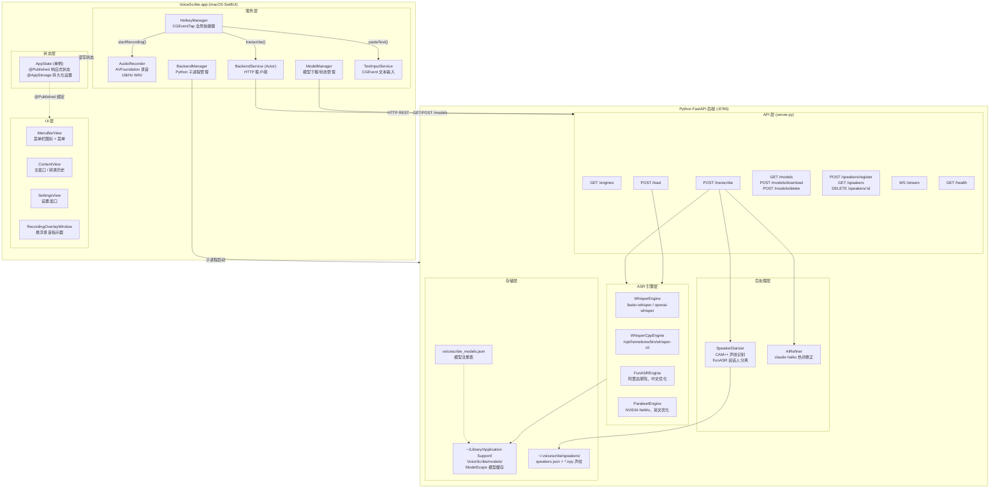
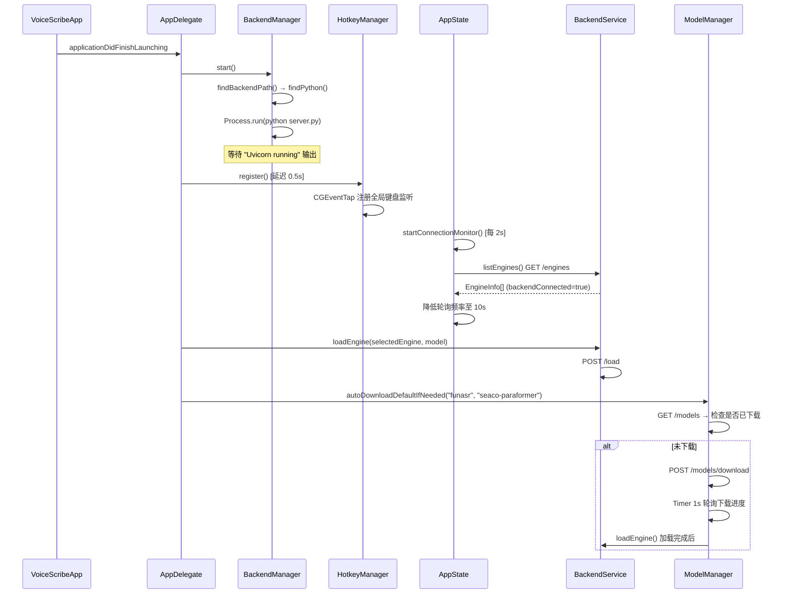
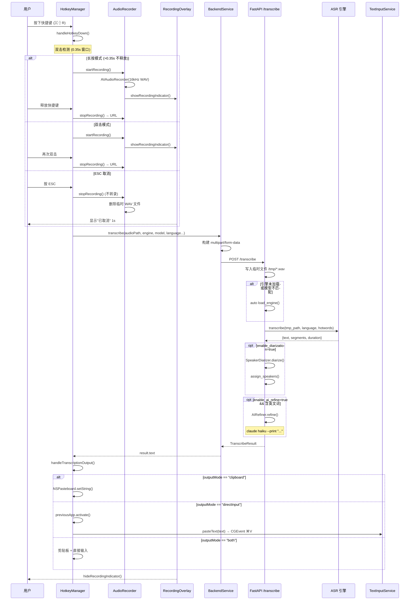

# VoiceScribe 项目架构文档

> 更新日期：2026-03-25
> 项目路径：`voicescribe/0324/voicescribe`

---

## 一、整体架构图



---

## 二、业务流程图

### 2.1 应用启动流程



### 2.2 核心录音转录流程



### 2.3 模型管理流程

```mermaid
flowchart TD
    A[用户打开设置页] --> B[ModelManager.refresh()]
    B --> C[GET /models]
    C --> D{FunASR 模型状态}

    D -->|available=true| E[显示已下载 + 大小]
    D -->|downloading=true| F[显示进度条\nTimer 1s 轮询]
    D -->|available=false| G[显示下载按钮]

    G --> H[用户点击下载]
    H --> I[POST /models/download]
    I --> J[asyncio 后台下载\nmodelscope snapshot_download]
    J --> K[monitor_cache: 每1s统计目录大小]
    K --> F
    F --> L{下载完成?}
    L -->|是| M[_set_registry_entry\n写入 voicescribe_models.json]
    M --> E
    L -->|否| F

    E --> N[用户点击加载引擎]
    N --> O[POST /load\nengine + model]
    O --> P[FunASREngine.load()]
    P --> Q[engines dict 缓存实例]
```

---

## 三、模块详细说明

### 3.1 前端模块

#### AppState（`app/VoiceScribe/Models/AppState.swift`）

全局单例状态管理，所有 UI 组件共享。

| 属性 | 类型 | 默认值 | 说明 |
|------|------|--------|------|
| `isRecording` | `@Published Bool` | false | 当前是否录音中 |
| `isTranscribing` | `@Published Bool` | false | 是否正在转录 |
| `recordingCancelled` | `@Published Bool` | false | ESC 取消后短暂为 true |
| `audioLevel` | `@Published Float` | 0 | 麦克风音量 0-1 |
| `backendConnected` | `@Published Bool` | false | 后端连接状态 |
| `selectedEngine` | `@AppStorage String` | "funasr" | 当前选择的 ASR 引擎 |
| `selectedModel` | `@AppStorage String` | "seaco-paraformer" | 当前选择的模型 |
| `language` | `@AppStorage String` | "zh" | 转录语言代码 |
| `enableDiarization` | `@AppStorage Bool` | false | 启用说话人识别 |
| `hotkeyModifiers` | `@AppStorage Int` | 0x120000 (⌘⇧) | 快捷键修饰键掩码 |
| `hotkeyKeyCode` | `@AppStorage Int` | 15 (R) | 快捷键键码 |
| `outputMode` | `@AppStorage String` | "directInput" | 输出方式 |
| `hotwords` | `@AppStorage String` | "" | 热词（逗号分隔） |
| `enableAIRefine` | `@AppStorage Bool` | false | 启用 AI 文本优化 |

**连接监控策略：**
- 未连接时：每 2 秒轮询一次 `GET /engines`
- 连接成功后：降频至每 10 秒

---

#### AudioRecorder（`app/VoiceScribe/Services/AudioRecorder.swift`）

AVFoundation 录音封装，固定参数输出标准 ASR 输入格式。

| 参数 | 值 | 说明 |
|------|----|------|
| `AVFormatIDKey` | `kAudioFormatLinearPCM` | PCM 无损格式 |
| `AVSampleRateKey` | **16000** Hz | ASR 模型标准采样率 |
| `AVNumberOfChannelsKey` | **1** | 单声道（减少文件大小）|
| `AVLinearPCMBitDepthKey` | **16** bit | 16位整数 |
| `AVLinearPCMIsFloatKey` | false | 整数格式 |
| 计时精度 | 0.1 秒 | Timer 更新 duration 和 audioLevel |
| 输出路径 | `/tmp/recording_<timestamp>.wav` | 转录后由 server.py 删除 |

**错误类型：**
- `RecorderError.permissionDenied`：无麦克风权限，自动打开系统设置
- `RecorderError.recordFailed`：录音器创建或启动失败

---

#### HotkeyManager（`app/VoiceScribe/Services/HotkeyManager.swift`）

使用 CGEventTap（非 Carbon API）实现全局键盘拦截，支持三种触发模式。

| 配置项 | 值 | 说明 |
|--------|----|------|
| EventTap 位置 | `.cgSessionEventTap` → `.cghidEventTap`（降级）| 优先 Session 级别 |
| 双击阈值 | **0.35 秒** | 两次按下间隔小于此值为双击 |
| 监听事件 | `keyDown` + `keyUp` + `flagsChanged` | 支持纯修饰键模式（keyCode=-1）|
| ESC 键码 | 53 | 录音中按 ESC 取消 |

**触发模式：**

```
单次按下 → 启动长按定时器(0.35s)
  ├── 超过 0.35s 未释放 → 长按录音模式（按住录，松开转录）
  ├── 0.35s 内第二次按下 → 双击模式（切换录音开关）
  └── 0.35s 内释放 → 等待第二次按下

ESC 键 → 取消当前录音（不转录，删除临时文件）
```

**输出处理（`handleTranscriptionOutput`）：**

| outputMode | 行为 |
|------------|------|
| `clipboard` | 写入 `NSPasteboard.general` |
| `directInput` | 激活 previousApp → `TextInputService.pasteText()` |
| `both` | 先写剪贴板，再直接输入 |

特殊情况：若 previousApp 是 VoiceScribe 本身，强制切换为 `clipboard` 模式。

**转录重试机制：** 最多重试 30 次，每次间隔 2 秒（等待模型加载完成）。

---

#### BackendService（`app/VoiceScribe/Services/BackendService.swift`）

Swift `actor` 确保线程安全的 HTTP 客户端，所有调用均为 `async throws`。

| 接口 | 方法 | 路径 | 超时 |
|------|------|------|------|
| `listEngines()` | GET | `/engines` | 默认 |
| `loadEngine(engine:model:)` | POST | `/load` | 默认 |
| `transcribe(...)` | POST | `/transcribe` | **300 秒** |
| `registerSpeaker(name:audioPath:)` | POST | `/speakers/register` | 默认 |
| `listSpeakers()` | GET | `/speakers` | 默认 |
| `deleteSpeaker(speakerId:)` | DELETE | `/speakers/:id` | 默认 |

`transcribe` 请求参数（multipart/form-data）：

| 字段 | 类型 | 说明 |
|------|------|------|
| `audio` | File (WAV) | 录音文件 |
| `engine` | String | whisper / funasr / whispercpp / parakeet |
| `model` | String | 模型名称 |
| `language` | String | 语言代码（zh/en/ja...）|
| `enable_diarization` | Bool | 说话人识别 |
| `enable_ai_refine` | Bool | AI 文本优化 |
| `hotwords` | String | 热词（逗号分隔，可选）|

---

#### BackendManager（`app/VoiceScribe/Services/BackendManager.swift`）

管理 Python FastAPI 后端子进程的完整生命周期。

**Python 查找优先级：**
1. Bundle 内嵌 Python（`Resources/python/bin/python3`）
2. 项目目录 `backend/venv/bin/python3`
3. Homebrew `/opt/homebrew/bin/python3`
4. 系统 `/usr/local/bin/python3`、`/usr/bin/python3`

**后端目录查找优先级：**
1. `Bundle.main.resourcePath/backend`（有 venv）
2. 可执行文件相对路径（开发模式，`../../../backend` 等）
3. Bundle 内 `backend`（无 venv，触发自动安装）

**环境变量注入：**

| 变量 | 值 | 用途 |
|------|----|------|
| `PYTHONUNBUFFERED` | 1 | 实时输出日志 |
| `PATH` | 追加 `/opt/homebrew/bin` | ffmpeg 等工具可用 |
| `VOICESCRIBE_MODEL_DIR` | `~/Library/Application Support/VoiceScribe/models` | 模型缓存目录 |
| `MODELSCOPE_CACHE` | 同上 | ModelScope 下载目录 |
| `PYTHONHOME` | 嵌入式 Python 目录 | 仅嵌入式模式 |

**自动安装依赖（仅 DEBUG / 显式授权）：**
- 步骤：创建 venv → 升级 pip → `pip install -r requirements.txt`
- 完成后延迟 2 秒自动启动后端

---

#### TextInputService（`app/VoiceScribe/Services/TextInputService.swift`）

两种文本输出方式，根据辅助功能权限自动降级。

| 方法 | 实现 | 需要权限 |
|------|------|----------|
| `typeText()` | CGEvent Unicode 逐字符注入 | AXIsProcessTrusted |
| `pasteText()` | NSPasteboard + CGEvent ⌘V (virtualKey=9) | AXIsProcessTrusted |

实际流程：`pasteText()` 先写剪贴板，再用 CGEvent 模拟 `⌘V`（避免 AppleScript 沙盒问题）。

---

#### ModelManager（`app/VoiceScribe/Services/ModelManager.swift`）

管理 FunASR 模型的下载、删除、状态轮询（仅 FunASR 引擎）。

| 状态 | 含义 |
|------|------|
| `available=true` | 已下载，可立即加载 |
| `downloading=true` | 下载中，Timer 1s 轮询进度 |
| `available=false, downloading=false` | 未下载 |

**`autoDownloadDefaultIfNeeded`：**
- 通过 `@AppStorage("didAutoDownloadDefaultModel")` 保证只自动下载一次
- 下载完成后自动触发 `POST /load`

---

### 3.2 后端模块

#### server.py（`backend/server.py`）

FastAPI 主程序，端口 `127.0.0.1:8765`，支持 Mock 模式。

**启动参数：**

| 参数 | 默认值 | 说明 |
|------|--------|------|
| `--mock` | false | Mock 模式，返回硬编码结果（无需 ASR 依赖）|
| `--host` | 127.0.0.1 | 绑定地址 |
| `--port` | 8765 | 绑定端口 |

**环境变量：**

| 变量 | 说明 |
|------|------|
| `VOICESCRIBE_MODEL_DIR` | 模型缓存目录（覆盖默认值）|
| `MODELSCOPE_CACHE` | ModelScope 下载目录 |
| `VOICESCRIBE_PRELOAD_MODELS=1` | 启动时预加载 FunASR seaco-paraformer |

**Mock 自动触发条件：** `--mock` 参数，或所有引擎均不可用时。

**全局引擎实例缓存：**
```python
engines = {
    "whisper": {"engine": WhisperEngine(), "model": "medium"},
    "funasr":  {"engine": FunASREngine(),  "model": "seaco-paraformer", "diarization": False},
    ...
}
```
若请求的 `model` 与缓存不一致，自动重新加载。

**模型注册表（`voicescribe_models.json`）格式：**
```json
{
  "funasr": {
    "seaco-paraformer": {
      "path": "/Users/xxx/Library/Application Support/VoiceScribe/models/iic/...",
      "size_bytes": 1234567890,
      "updated_at": "2026-03-25T10:00:00"
    }
  }
}
```

---

#### WhisperEngine（`backend/engines/whisper_engine.py`）

支持 faster-whisper（推荐）和 openai-whisper 两种后端。

| 参数 | 值 | 说明 |
|------|----|------|
| `use_faster` | true | 优先使用 faster-whisper |
| `device` | "auto" | 自动选择 CPU/GPU |
| `compute_type` | "int8" | INT8 量化，平衡速度和精度 |
| `beam_size` | 5 | Beam Search 宽度 |
| `vad_filter` | true | 过滤静音段 |
| `vad min_silence_duration_ms` | 500ms | 最小静音长度 |

**可用模型：** `tiny` / `base` / `small` / `medium` / `large-v2` / `large-v3`

---

#### FunASREngine（`backend/engines/funasr_engine.py`）

阿里达摩院 FunASR，中文识别效果最优。

| 模型名 | ModelScope ID | 特点 |
|--------|---------------|------|
| `paraformer-zh` | `iic/speech_paraformer-large-vad-punc_asr_nat-zh-cn-16k-common-vocab8404-pytorch` | 通用中文 |
| `seaco-paraformer` | `iic/speech_seaco_paraformer_large_asr_nat-zh-cn-16k-common-vocab8404-pytorch` | **热词优化**，默认选择 |
| `sensevoice-small` | `iic/SenseVoiceSmall` | 多语言，情感识别 |

**加载参数（seaco-paraformer / paraformer-zh）：**

| 参数 | 值 | 说明 |
|------|----|------|
| `vad_model` | "fsmn-vad" | 语音活动检测 |
| `punc_model` | "ct-punc" | 标点预测 |
| `model_revision` | "v2.0.4" | 固定版本 |
| `device` | CUDA > MPS > CPU | 自动选择 |
| `spk_model` (可选) | "cam++" | 启用说话人识别 |
| `spk_mode` (可选) | "punc_segment" | 按标点分段识别说话人 |

**推理参数：**

| 参数 | 值 | 说明 |
|------|----|------|
| `batch_size_s` | 300 | 每批处理 300 秒音频 |
| `hotword` | 热词字符串 | 空格分隔，可带权重（`claude 50`）|

**热词格式：** 逗号分隔 → 空格分隔，支持带权重（`word 权重值`）

**中文文本后处理：** 正则去除中文字符间的多余空格。

---

#### SpeakerDiarizer（`backend/diarization/speaker.py`）

基于 FunASR CAM++ 的说话人识别，支持声纹注册和匹配。

**使用的模型：**

| 用途 | 模型 ID |
|------|---------|
| 声纹验证 (SV) | `damo/speech_campplus_sv_zh-cn_16k-common` |
| 说话人分离（优先）| `iic/speech_campplus_speaker-diarization_common` |
| 说话人分离（备选）| `damo/speech_diarization_sond-zh-cn-alimeeting-16k-n16k4-pytorch` |
| 自定义覆盖 | 环境变量 `VOICESCRIBE_DIARIZATION_MODEL` |

**关键参数：**

| 参数 | 值 | 说明 |
|------|----|------|
| 相似度阈值 | **0.7** | 余弦相似度，低于此值不认为是同一人 |
| 最小片段时长 | 1.0 秒（可通过 `VOICESCRIBE_SPK_MIN_SEC` 覆盖）| 提取声纹的最小音频长度 |
| 声纹算法 | 余弦相似度 | `dot(a,b) / (|a| * |b|)` |

**数据存储：**
- `~/.voicescribe/speakers/speakers.json`：说话人列表（id + name）
- `~/.voicescribe/speakers/<id>.npy`：声纹 embedding 向量

**两条说话人识别路径：**

```
路径 A（FunASR 内置，推荐）：
  FunASREngine.load(spk_model="cam++") → 转录时同步输出 sentence_info[spk]
  → SpeakerDiarizer.assign_speakers() 仅做名字映射

路径 B（外部 diarization，备选）：
  SpeakerDiarizer.diarize() → 分离时间段 + 说话人标签
  → 提取各段声纹 embedding → 与注册库余弦匹配
  → assign_speakers() 合并到转录结果
```

---

#### AIRefiner（`backend/postprocess/ai_refiner.py`）

调用 `claude haiku` CLI 进行转录文本的热词修正。

| 配置 | 值/路径 |
|------|---------|
| Claude 模型 | `haiku`（通过 `claude --model haiku --print` 调用）|
| 调用方式 | `subprocess.run(["claude", "--model", "haiku", "--print", prompt])` |
| 超时时间 | 30 秒 |
| 自定义 Prompt 路径 | `~/.voicescribe/refine_prompt.txt` |

**触发条件（智能判断）：**
- 有热词配置 **且** 文本中检测到英文词（`[a-zA-Z]{2,}`）→ 调用 AI 修正
- 无热词 → 直接返回原文（不调用 AI）

**默认 Prompt 行为：**
1. 删除语气词（呃、嗯、啊、额、那个、就是等）
2. 修正错别字和语法错误
3. 热词发音相似词替换

---

## 四、数据结构总览

### 转录结果（前后端共享）

```
TranscribeResult / Transcription
├── text: String          -- 完整转录文本（带说话人标签时格式为 [Name] text）
├── segments: [Segment]   -- 时间戳分段
│   ├── start: Double     -- 开始时间（秒）
│   ├── end: Double       -- 结束时间（秒）
│   ├── text: String      -- 该段文本
│   └── speaker: String?  -- 说话人标签（SPEAKER_00 或注册姓名）
├── duration: Double      -- 总时长（秒）
├── engine: String        -- 使用的引擎名
└── model: String         -- 使用的模型名
```

### 引擎信息

```
EngineInfo
├── name: String          -- 引擎标识（whisper/funasr/whispercpp/parakeet）
├── models: [String]      -- 支持的模型列表
├── loaded_model: String? -- 当前已加载的模型
└── available: Bool       -- 是否可用（依赖已安装）
```

---

## 五、目录结构速查

```
voicescribe/
├── app/                          # Swift 前端
│   └── VoiceScribe/
│       ├── Models/AppState.swift          # 全局状态
│       ├── Services/
│       │   ├── AudioRecorder.swift        # 录音
│       │   ├── BackendManager.swift       # 后端进程管理
│       │   ├── BackendService.swift       # HTTP 客户端 (actor)
│       │   ├── HotkeyManager.swift        # 全局快捷键
│       │   ├── HotkeyKeyMap.swift         # 键码映射表
│       │   ├── ModelManager.swift         # 模型下载管理
│       │   └── TextInputService.swift     # 文本输入
│       ├── Views/
│       │   ├── ContentView.swift          # 主窗口
│       │   ├── MenuBarView.swift          # 菜单栏
│       │   ├── RecordingOverlayWindow.swift # 悬浮指示器
│       │   └── SettingsView.swift         # 设置
│       └── VoiceScribeApp.swift           # 入口 + AppDelegate
│
├── backend/                      # Python 后端
│   ├── server.py                  # FastAPI 主程序
│   ├── engines/
│   │   ├── whisper_engine.py      # OpenAI Whisper / faster-whisper
│   │   ├── whispercpp_engine.py   # Whisper.cpp CLI
│   │   ├── funasr_engine.py       # 阿里 FunASR
│   │   └── parakeet_engine.py     # NVIDIA Parakeet
│   ├── diarization/
│   │   └── speaker.py             # CAM++ 声纹识别
│   └── postprocess/
│       └── ai_refiner.py          # Claude 热词修正
│
├── docs/
│   └── 0325项目初始.md            # 本文档
│
└── ~/Library/Application Support/VoiceScribe/models/   # 运行时模型缓存
    └── voicescribe_models.json
```
