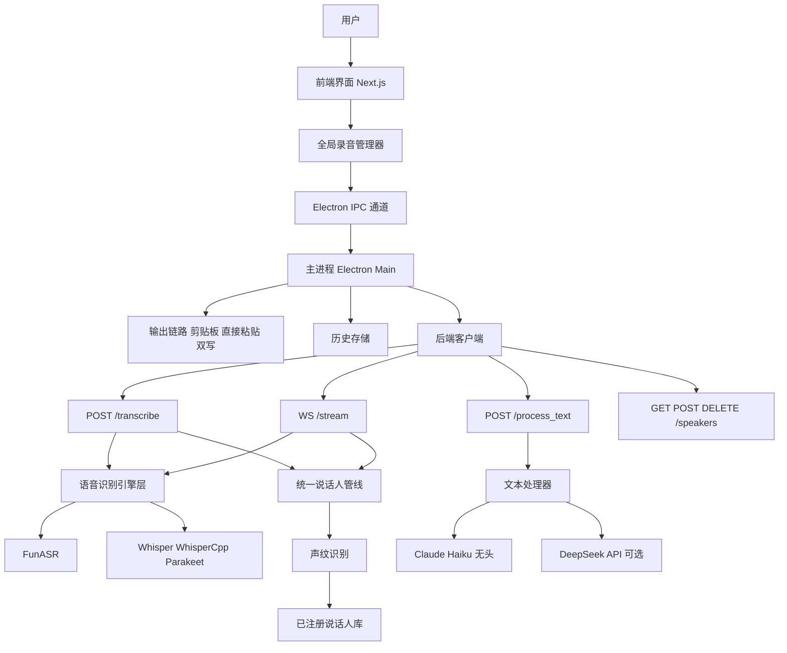
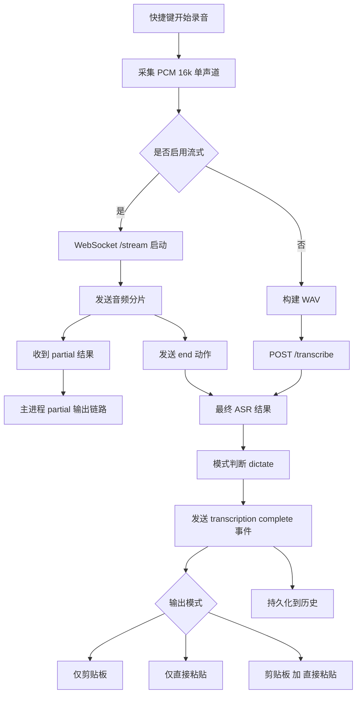
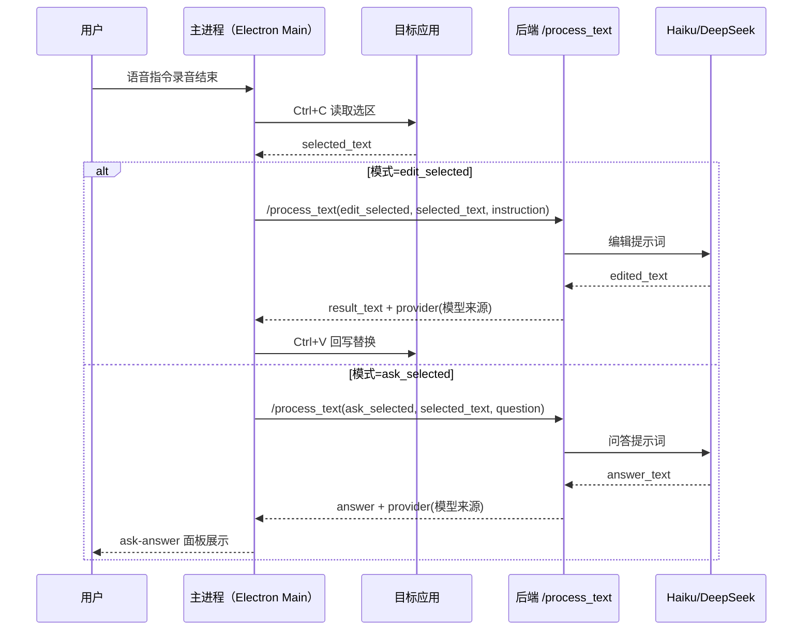
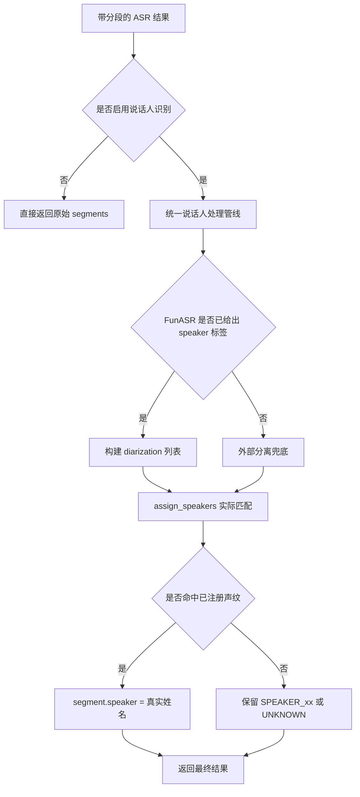

# VoiceScribe 第一阶段 MVP 需求文档

> **版本**: v1.2  
> **日期**: 2026-03-03  
> **阶段**: MVP（可用闭环）  
> **状态**: 迭代中（核心闭环已上线，稳定性与体验持续完善）  
> **变更**: 按 `memory/2026-03-02.md` 与近期开发日志更新“已实现/未实现”状态清单

---

## 一、平台定位

**一句话**：面向桌面场景的本地优先语音输入与语音编辑工具。  

**核心价值**：
- 即录即写：全局快捷键触发，跨应用快速输入
- 选区可编可问：支持选中文本后“语音编辑/语音问答”
- 本地可控：本地 ASR + 热词 + 说话人识别 + 可选 AI 文本处理

---

## 二、开发路线总览

```text
第一阶段            第二阶段            第三阶段            第四阶段
基础闭环(MVP)       体验增强            治理与稳定          个性化与智能化
══════════════      ══════════════      ══════════════      ══════════════
语音转写            命令系统            E2E 回归            个性化词典
选区编辑            翻译模式            质量指标            风格学习
选区问答            联网问答            数据治理            智能推荐
说话人基础          流式可视化          多说话人策略         自动化优化
```

### 2.1 当前实现状态清单（已实现 / 未实现）

| 能力 | 当前状态 | 现状说明 |
|------|----------|----------|
| `dictate` 语音转写闭环 | 已实现 | 录音 -> ASR -> 输出链路可用 |
| `edit_selected` 闭环 | 已实现 | 读取选区 -> `/process_text` -> 回写替换 |
| `ask_selected` 闭环 | 已实现 | 读取选区 -> `/process_text` -> 问答面板展示 |
| 流式 + 非流式转写双链路 | 已实现 | `/stream` 与 `/transcribe` 并行可用 |
| partial 接入输出链路 | 已实现 | 已接入 partial，并处理重叠片段重复文本 |
| FunASR 模型路径统一（hub） | 已实现 | 主模型/VAD/PUNC 优先使用 `hub/models` 本地路径 |
| AIRefiner 超时与编码修复 | 已实现 | 超时调整为 20 分钟，子进程统一 UTF-8 解码 |
| 说话人注册/列表/删除 | 已实现 | `/speakers/register`、`/speakers`、`/speakers/{id}` |
| 流式与非流式共用说话人管线 | 已实现 | 服务端统一走同一 speaker pipeline |
| 说话人“严格真实匹配”验收 | 未完成 | 需补多说话人场景与阈值策略验收 |
| `translate` 模式 | 未实现 | 当前仅 `dictate/edit_selected/ask_selected` |
| 命令系统（预设+自定义路由） | 未实现 | 仅有编辑命令基础项，缺统一命令路由器 |
| 联网问答（Web 检索总结） | 未实现 | 当前 Ask 仅基于选中文本上下文 |
| 个性化学习层 | 未实现 | 无用户词典自动增长/风格学习 |
| E2E 自动化回归 | 未完成 | 已有 smoke，缺完整端到端自动化 |

### 2.2 优先级计划（对齐 `memory/2026-03-02.md`）

| 优先级 | 项目 | 目标 |
|------|------|------|
| P0（2-4 周） | `translate` 最小闭环 | 新增翻译模式与目标语言设置 |
| P0（2-4 周） | 流式体验可视化 | partial 展示策略产品化（覆盖/追加可选） |
| P0（2-4 周） | 直接输入稳定性 | `directInput` 成功率提升 + 失败显式反馈 |
| P0（2-4 周） | 说话人严格匹配验收 | 完成多说话人真实匹配与阈值验证 |
| P1（4-8 周） | 命令系统 | 预设命令 + 自定义命令 + 提示词模板 |
| P1（4-8 周） | Ask Anything 增强 | 选区问答扩展到可选联网检索总结 |
| P2（8 周+） | 个性化层 | 用户词典增长、风格偏好、常用命令学习 |
| P2（8 周+） | E2E 回归体系 | 录音到导出的端到端自动化验收 |

---

## 三、第一阶段范围定义

### 3.1 Must Have（必须实现）

| 模块 | 功能 | 状态 |
|------|------|------|
| 录音控制 | 全局快捷键、托盘常驻、悬浮层状态显示 | 已实现 |
| 语音转写 | 本地/后端 ASR，支持流式与非流式 | 已实现 |
| 输出链路 | `clipboard` / `directInput` / `both` | 已实现 |
| 工作模式 | `dictate` / `edit_selected` / `ask_selected` | 已实现 |
| 文本处理 | `/process_text`（编辑/问答） | 已实现 |
| 设置系统 | 引擎、语言、输出、快捷键、流式、说话人开关 | 已实现 |
| 历史记录 | 持久化、搜索、删除、导出 | 已实现 |
| 说话人管理 | 注册、列表、删除、分段标注 | 已实现 |

### 3.2 Reserve（预留，后续阶段开放）

| 模块 | 预留内容 | 计划阶段 | 状态 |
|------|----------|----------|------|
| 翻译模式 | `translate` 模式与目标语言策略 | P0 | 未实现 |
| 命令系统 | 预设/自定义命令与路由器 | P1 | 未实现 |
| 联网问答 | Web 检索 + 总结通路 | P1 | 未实现 |
| 个性化能力 | 词典增长、风格偏好学习 | P2 | 未实现 |
| 全链路回归 | E2E 自动化回归与压测 | P2 | 未完成 |

---

## 四、功能需求详解

### 4.1 录音与转写

| 功能 | 说明 | 优先级 | 状态 |
|------|------|--------|------|
| 全局快捷键录音 | 任意应用中开始/结束录音 | P0 | 已实现 |
| 悬浮层反馈 | 录音/转写状态与音量反馈 | P0 | 已实现 |
| 音频采集 | 16kHz 单声道 PCM | P0 | 已实现 |
| 转写引擎 | FunASR/Whisper/WhisperCpp/Parakeet | P0 | 已实现（按环境可用） |
| 流式转写 | partial + final | P1 | 已实现 |

### 4.2 输出与编辑工作流

| 功能 | 说明 | 优先级 | 状态 |
|------|------|--------|------|
| Dictate 模式 | 转写文本输出到目标应用 | P0 | 已实现 |
| Edit Selected | 选区读取 + 语音编辑 + 回写 | P0 | 已实现(未测试) |
| Ask Selected | 选区读取 + 语音提问 + 面板展示 | P0 | 已实现(未测试) |
| 输出模式 | `clipboard` / `directInput` / `both` | P0 | 已实现 |
| 回写失败回退 | 失败回退剪贴板并通知 | P1 | 已实现 |

### 4.3 说话人与热词

| 功能 | 说明 | 优先级 | 状态 |
|------|------|--------|------|
| 热词支持 | 用户词表维护，转写时注入 | P0 | 已实现 |
| 声纹注册 | 录制样本并注册说话人 | P0 | 已实现 |
| 分段标注 | `segments[].speaker` 输出 | P0 | 已实现 |
| 严格真实匹配 | 不做默认自动命名兜底 | P0 | 未完成（验收待补） |

### 4.4 模型与稳定性

| 功能 | 说明 | 优先级 | 状态 |
|------|------|--------|------|
| 模型路径统一 | FunASR 主模型/VAD/PUNC 使用 hub 本地目录 | P0 | 已实现 |
| AIRefiner 超时配置 | 默认超时提升至 1200 秒 | P0 | 已实现 |
| 子进程编码健壮性 | `subprocess.run` 统一 UTF-8 解码 | P0 | 已实现 |

---

## 五、业务模块与流程设计

### 5.1 Dictate 主流程

```text
快捷键开始录音
  ↓
采集音频（流式或整段）
  ↓
后端转写（ASR + 可选 AI 优化 + 可选说话人）
  ↓
主进程分发 transcription-complete
  ↓
按输出模式写入（剪贴板/直接粘贴）
  ↓
写入历史记录
```

### 5.2 Edit Selected 流程

```text
用户先在目标应用选中文本
  ↓
快捷键录音（语音指令）
  ↓
读取选中文本（Ctrl+C，失败重试）
  ↓
/process_text(mode=edit_selected)
  ↓
Ctrl+V 回写替换（失败回退剪贴板）
```

### 5.3 Ask Selected 流程

```text
用户先在目标应用选中文本
  ↓
快捷键录音（语音问题）
  ↓
读取选中文本（Ctrl+C）
  ↓
/process_text(mode=ask_selected)
  ↓
前端展示问答结果面板
```

### 5.4 说话人处理流程（统一管线）

```text
/transcribe 与 /stream
  ↓
统一调用 apply_unified_speaker_system
  ↓
优先使用引擎已有 speaker 标签
  ↓
必要时外部分离兜底
  ↓
assign_speakers 实际匹配已注册声纹
  ↓
输出带 speaker 的 segments
```

---

## 六、技术架构

| 层级 | 组件 | 责任 |
|------|------|------|
| 桌面层 | Electron Main/Preload | 全局快捷键、IPC、系统集成、输出控制 |
| UI 层 | Next.js + React + Zustand | 设置页、历史页、录音态、问答面板 |
| 服务层 | FastAPI | 转写接口、流式 WS、文本处理、说话人接口 |
| 引擎层 | FunASR/Whisper 等 | 语音识别、分段、说话人标签基础输出 |
| 数据层 | 本地配置 + 本地缓存 | 设置持久化、历史记录、模型缓存、声纹数据 |

---

## 七、接口范围（MVP）

| 接口 | 方法 | 说明 | 状态 |
|------|------|------|------|
| `/health` | GET | 健康检查 | 已实现 |
| `/engines` | GET | 引擎与可用性 | 已实现 |
| `/load` | POST | 加载引擎模型 | 已实现 |
| `/transcribe` | POST | 非流式转写 | 已实现 |
| `/stream` | WS | 流式转写（partial/final） | 已实现 |
| `/process_text` | POST | 选区编辑/问答 | 已实现 |
| `/speakers/register` | POST | 说话人注册 | 已实现 |
| `/speakers` | GET | 说话人列表 | 已实现 |
| `/speakers/{id}` | DELETE | 说话人删除 | 已实现 |

---

## 八、非功能要求

| 维度 | 要求 |
|------|------|
| 可用性 | 常见录音场景稳定可用，失败可回退 |
| 性能 | 流式持续输出 partial，非流式在可接受时延返回 |
| 可靠性 | 子进程统一 UTF-8 解码，避免编码崩溃 |
| 可观测性 | 关键流程日志可定位（模式、分支、provider、回写结果） |
| 可维护性 | 流式与非流式共用说话人系统逻辑 |

---

## 九、待确认事项

| # | 问题 | 当前结论 |
|---|------|----------|
| 1 | 说话人“严格真实匹配”阈值 | 待确定统一阈值与多说话人策略 |
| 2 | 流式 partial 展示策略 | 待在 UI 层确定覆盖/追加交互方案 |
| 3 | 模型路由策略 | 当前优先 Haiku，失败可配置 DeepSeek |
| 4 | 翻译模式落地范围 | 待确定 MVP 语言对与回写策略 |

---

## 十、验收标准

### 10.1 功能验收清单

**录音与转写**
- [x] `dictate` 模式可稳定输出到目标应用
- [x] 流式与非流式均可返回文本
- [x] partial 已接入输出链路

**选区工作流**
- [x] `edit_selected` 完成“读取选区 -> 编辑 -> 回写”
- [x] `ask_selected` 可返回答案并展示
- [x] 选区读取失败可提示并回退

**模型与文本处理**
- [x] `/process_text` 在 `edit_selected/ask_selected` 可用
- [x] FunASR 路径统一后不再重复下载到 `~/.cache/modelscope/models`
- [x] AIRefiner 超时与编码修复已生效

**说话人与历史**
- [x] 说话人注册/列表/删除可用
- [x] 历史记录可查询、删除、导出
- [ ] 说话人严格真实匹配通过多说话人完整验收

**预留功能**
- [ ] `translate` 模式
- [ ] 命令系统（预设 + 自定义）
- [ ] 联网问答（Web 检索总结）

### 10.2 技术验收清单

- [x] 后端 `py_compile` 通过
- [x] 前端 TypeScript 与 Electron 构建通过
- [x] 关键接口可用：`/health`、`/transcribe`、`/stream`、`/process_text`
- [ ] 端到端自动化回归（E2E）通过

---

## 十一、后续阶段规划

### 第二阶段（体验增强）

| 模块 | 功能说明 |
|------|----------|
| 翻译模式 | `translate` 最小闭环、目标语言配置 |
| 命令系统 | 预设命令、自定义命令、提示词模板 |
| Ask 增强 | 选区问答 + 可选联网检索总结 |
| 流式产品化 | partial 可视化与交互策略完善 |

### 第三阶段（治理与稳定）

| 模块 | 功能说明 |
|------|----------|
| 说话人治理 | 阈值策略、多说话人稳定性验收 |
| 数据治理 | 历史保留、自动清理、导出与彻底删除 |
| 回归体系 | E2E 自动化与稳定性压测 |

### 第四阶段（个性化与智能化）

| 模块 | 功能说明 |
|------|----------|
| 个性化层 | 用户词典自动增长、风格偏好学习 |
| 智能推荐 | 命令与模式自动推荐 |
| 自进化优化 | 基于使用数据持续优化策略 |

---

## 十二、Mermaid 实验架构与数据流程（当前已验证）

### 12.1 逻辑架构图



### 12.2 转写数据流（Dictate）



### 12.3 选中文本编辑/问答数据流（Edit/Ask）



### 12.4 说话人识别数据流（统一管线）



---

## 附录：术语

| 术语 | 说明 |
|------|------|
| Dictate | 语音转文字直接输出模式 |
| Edit Selected | 对当前选中文本执行语音编辑指令 |
| Ask Selected | 基于当前选中文本进行语音问答 |
| Hotwords | 转写时注入的业务词/专有名词词表 |
| Diarization | 说话人分离与识别 |

---

**文档版本**: v1.2  
**更新日期**: 2026-03-03  
**状态**: 已补充“已实现/未实现”完整清单，并对齐参考 PRD 章节风格嗯嗯，就是我是做了这四个平台，就是still sq四MP,然后是那个小小龙虾的，还有一个是四六点，这个还有一个四六点，f三差不多。我个得对比，应该还有一些新的。但是这这几个就算比较还是比较主流，比较主流了，嗯，还以还有一对。然后大概这些网站的功能是做了一个整体的一个对比。
