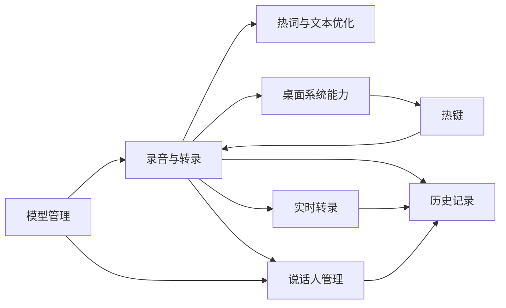
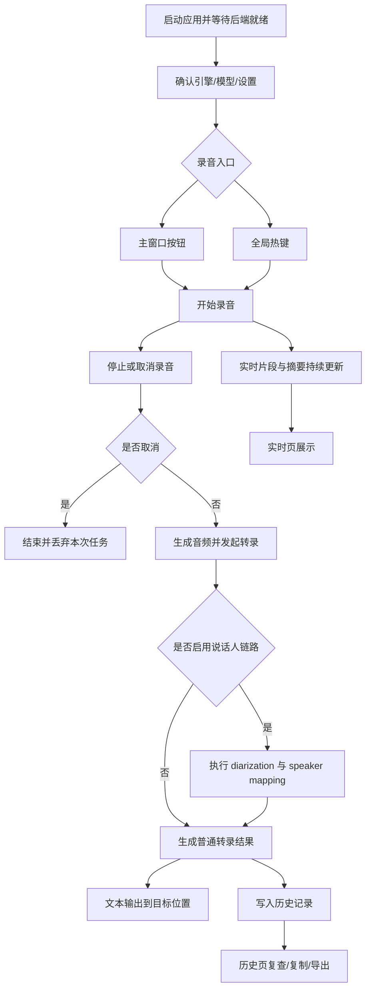

# VoiceScribe 统一需求文档

更新时间：2026-04-02  
文档定位：人工沟通与需求确认源文档。  
配套文档：
- `docs/SPEC.md`
- `docs/TEST.md`
- `docs/BUGS.md`

## 1. 背景与问题

### 1.1 项目背景

VoiceScribe 是一个 Windows 桌面端本地语音转写工具。当前系统已经具备主窗口、Tauri 桌面能力、本地 Python 后端、多引擎模型管理、说话人相关能力、实时转录和历史记录等基础能力，但整体仍处于 Phase 1 尾项收口阶段。

当前项目不是从零开始设计，而是在已有实现基础上继续收口与规范化。

### 1.2 当前痛点与问题

当前系统的主要问题不是“完全没有功能”，而是：

- 已有功能分散在多层，跨层问题定位成本高
- 某些关键链路已能运行，但还没有稳定收口
- 部分模型状态、下载状态和真实可运行状态容易被混淆
- 热键、桌面行为、运行时依赖等问题高度依赖 Windows 真实环境
- 旧文档过多，不利于 AI 后续快速理解当前真实状态

当前明确仍未收口的问题包括：
- 冷启动后 `Right Alt` 不触发
- 热键 Apply 后恢复链未定位清楚
- `pyannote-3.1` 真实下载与真实运行时未验收
- `Qwen3-ASR` 与 `3D-Speaker` 真实验收未完成
- 启动期 warning 尚未统一收口

### 1.3 为什么现在要做

当前需要重建统一需求文档，是因为后续开发已经不适合继续依赖大量分散归档文档。需要一份统一的、面向人类和 AI 的需求源文档，用来明确：

- 当前产品到底要继续收口什么
- 哪些功能已经具备
- 哪些功能只是部分可用
- 哪些能力不在本期范围内
- 什么才算本期真正完成

## 2. 产品目标

### 2.1 总体目标

把 VoiceScribe 收口成一个可维护的 Windows 桌面语音转写产品，使其具备以下稳定能力：

- 用户可以开始、停止、取消录音
- 用户可以通过主窗口或热键控制录音
- 用户可以管理模型和查看模型状态
- 用户可以使用说话人分离与映射能力
- 用户可以查看实时转录和历史记录
- 所有模型、缓存和运行时状态都遵守统一约束

### 2.2 阶段目标

当前阶段目标：

- 收口 Phase 1 尾项问题
- 用统一需求文档和 `SPEC` 替代旧的多份阶段文档
- 把“已实现”“已测试”“已收口”三者分开表达
- 优先解决最影响使用闭环的热键和模型运行时问题

### 2.3 成功定义

本期工作成功的判断标准是：

- 后续开发可以只依赖 `PRD/SPEC/TEST/BUGS` 继续推进
- 核心产品能力和当前状态被清晰表达
- 未收口项被集中管理而不是散落在历史文档
- 关键主链具备明确的验收口径

## 3. 用户角色与使用场景

### 3.1 用户角色定义

#### 角色 A：普通桌面用户

目标：
- 快速把语音转换成文本
- 尽量减少切换窗口和重复操作

#### 角色 B：高频使用用户

目标：
- 使用热键、历史记录、热词和说话人能力提升效率

#### 角色 C：维护者 / 开发者

目标：
- 理解当前系统真实能力
- 定位跨层问题
- 在统一约束下继续改代码

### 3.2 核心使用场景

- 使用主窗口开始录音、停止录音并获得文本
- 使用全局热键开始、停止、取消录音
- 在引擎页查看模型状态、下载模型、预加载模型
- 在说话人页注册样本并在结果中得到说话人标签
- 在实时转录页查看片段和摘要
- 在历史记录页复查、复制、导出和删除记录

### 3.3 典型用户路径

#### 路径 A：主窗口录音转录

1. 打开应用
2. 确认当前引擎和模型
3. 开始录音
4. 停止录音
5. 查看转录结果
6. 输出文本
7. 在历史记录中复查

#### 路径 B：热键录音转录

1. 在快捷键页录制并应用热键
2. 切换到外部应用
3. 按热键开始录音
4. 再次按热键停止
5. 文本输出到目标位置

#### 路径 C：模型与说话人准备

1. 进入引擎页下载所需模型
2. 进入说话人页注册样本
3. 开启说话人链路
4. 发起转录任务
5. 查看带说话人标签的结果

## 4. 范围（In Scope）

### 4.1 本期建设范围

本期继续维护和收口的范围包括：

- 录音与转录主链
- 热键录音主链
- 多引擎模型管理
- 说话人样本管理
- 实时转录
- 历史记录
- 热词与 AI 文本优化
- Windows 桌面能力
- 文档体系重构

### 4.2 MVP 范围

当前产品最小可用闭环应至少包含：

- 启动应用
- 开始和停止录音
- 获得转录文本
- 输出文本
- 写入历史记录
- 基础模型状态可见

### 4.3 本期交付边界

本期交付重点不是扩展新业务，而是：

- 收口已有功能
- 明确需求和实现边界
- 提升后续 AI 开发可持续性

## 5. 非范围（Out of Scope）

### 5.1 本期不做的内容

- 用户体系
- 多设备同步
- Web 版
- 云服务化部署
- 多人协作
- 完整安装包商业化交付说明

### 5.2 后续可扩展方向

- 更完整的安装与发布链
- 更稳定的热键和桌面体验
- 更多模型与更清晰的模型矩阵
- 更强的说话人相关能力
- 更完整的 AI 摘要与整理能力

## 6. 业务模块与核心流程

### 6.1 业务模块划分

当前系统按业务划分为：

- 录音与转录
- 热键
- 模型管理
- 说话人管理
- 实时转录
- 历史记录
- 热词与文本优化
- 桌面系统能力

### 6.2 业务模块总览图

### 6.3 核心流程总览

### 6.4 异常流程 / 人工接管流程

当前需要显式考虑的异常流程：

- 后端未就绪
- 模型目录存在但模型不可用
- 下载需要 token 或下载不完整
- 说话人链路失败
- 录音过短
- 热键录制成功但运行时不生效
- Windows 真实环境下的系统能力失配

人工接管场景包括：

- 手动切换模型
- 手动删除错误下载结果
- 手动回归热键链路
- 手动验证托盘、Overlay、自动启动等桌面能力

## 7. 功能需求详解

### 7.1 录音与转录

#### 模块详细需求表

| 项 | 内容 |
|---|---|
| 功能说明 | 支持主窗口内开始录音、停止录音、取消录音，并在录音完成后得到结构化转录结果。 |
| 用户价值 | 形成最基础的语音转文本闭环，是全产品最核心主链。 |
| 输入 | 开始/停止/取消动作；当前引擎与模型；语言；热词；AI 文本优化开关；说话人链路开关。 |
| 输出 | 转录文本；分段结果；可选说话人标签；可选音频文件；历史记录入库对象。 |
| 规则与约束 | 普通 ASR 主链必须始终可单独运行；输出模式影响文本落点；历史记录和音频保留受设置控制。 |
| 异常处理 | 后端未就绪需可提示；过短录音不能进入长失败链；模型不可用时需返回可理解错误。 |
| 当前实现状态 | 已实现，但仍依赖实际模型可用性和后端运行时状态；说话人链路属于可选增强路径。 |
| 验收要点 | 主窗口开始/停止/取消完整可用；能得到文本；能写入历史；错误时有明确提示。 |

#### 补充说明

该模块是所有业务模块的汇合点。模型管理、热词、说话人、热键、实时页和桌面输出，最终都要回到这条主链上。

### 7.2 热键

#### 模块详细需求表

| 项 | 内容 |
|---|---|
| 功能说明 | 支持用户录制、保存、应用全局热键，并通过全局热键触发开始录音、停止录音或取消录音。 |
| 用户价值 | 支持跨窗口录音操作，减少切回主窗口的成本。 |
| 输入 | 设置页中的按键录制动作；持久化热键配置；Windows 全局键盘事件。 |
| 输出 | `HotkeyBinding` 配置；热键注册/恢复结果；录音控制事件。 |
| 规则与约束 | 录制态与运行态必须共享同一热键结构；Apply 后必须重新恢复运行时监听；冷启动时应自动恢复上次配置。 |
| 异常处理 | 录制成功但运行时未生效时必须可诊断；录制态必须暂停正式监听，避免误触发旧绑定。 |
| 当前实现状态 | 已实现配置、保存、应用和 runtime suspend/resume 主链，但冷启动 `Right Alt` 与 Apply 后恢复延迟仍未收口。 |
| 验收要点 | 冷启动后热键可直接触发；设置页 Apply 后无需长等待即可恢复；日志能定位注册、暂停、恢复和实际触发位置。 |

#### 补充说明

该模块高度依赖 Windows 真实环境，不能只靠浏览器态或静态构建结果判断通过。

### 7.3 模型管理

#### 模块详细需求表

| 项 | 内容 |
|---|---|
| 功能说明 | 支持查看模型状态、下载模型、删除模型、预加载模型，并在不同引擎/任务类型下统一表达模型可用性。 |
| 用户价值 | 用户无需手工查模型目录，即可在界面上理解模型是否可下载、已下载、可加载、可转录。 |
| 输入 | 模型列表请求；下载请求；删除请求；预加载请求；按模型存储的 token。 |
| 输出 | 模型状态对象；下载结果；删除结果；预加载结果；错误提示。 |
| 规则与约束 | 模型可用性不能只根据目录存在判断；模型主目录统一在仓库 `models/` 下；gated 模型允许要求 token。 |
| 异常处理 | 不完整目录必须显示为不可用；依赖缺失必须返回明确错误；下载半成功不能假装为已完成。 |
| 当前实现状态 | 已实现模型列表、下载、删除、预加载主链；`pyannote-3.1` 已补完整性校验，但真实下载和真实运行时验收仍未完成。 |
| 验收要点 | 模型状态与真实目录一致；下载后能得到可信状态；删除能清理 registry/path；预加载结果与真实加载结果一致。 |

#### 补充说明

模型管理不仅是引擎页展示问题，还直接影响转录请求、说话人链路和启动时运行时状态。

### 7.4 说话人管理

#### 模块详细需求表

| 项 | 内容 |
|---|---|
| 功能说明 | 支持注册、删除说话人样本，并在转录时可选启用 diarization 与 speaker mapping。 |
| 用户价值 | 帮助会议、访谈等多说话人场景识别讲话人身份。 |
| 输入 | 说话人姓名；WAV 样本；分离模型选择；映射模型选择；转录时的说话人开关。 |
| 输出 | 说话人列表；注册/删除结果；带说话人标签的转录分段。 |
| 规则与约束 | 样本注册与转录链路必须共享同一说话人数据；未注册样本时仍允许普通转录；说话人链路属于增强能力。 |
| 异常处理 | diarization 或 mapping 失败时不能拖垮纯 ASR 主链；缺模型或缺 token 时要返回明确提示。 |
| 当前实现状态 | 已实现样本管理和链路接入，但 `3D-Speaker` 与 `pyannote-3.1` 的真实加载、下载与转录验收仍未完成。 |
| 验收要点 | 能注册样本并回显；开启说话人链路后结果可带标签；失败时可回退普通转录。 |

#### 补充说明

该模块真实可用性的判定，必须同时依赖说话人模型、diarization 模型、token 和运行时依赖完整性。

### 7.5 实时转录

#### 模块详细需求表

| 项 | 内容 |
|---|---|
| 功能说明 | 支持在录音过程中展示实时片段、流式条目和 AI 摘要结果。 |
| 用户价值 | 用户无需等待整段录音结束即可看到阶段性内容反馈。 |
| 输入 | 流式音频片段；实时转录 entry；AI summary 条目。 |
| 输出 | 实时片段列表；摘要列表；页面展示状态。 |
| 规则与约束 | 实时页是展示面，不是录音控制唯一入口；AI 摘要建立在流式链路和后端服务可用的前提上。 |
| 异常处理 | 流式失败时不能影响普通录音完成后的离线转录；摘要失败需允许仅展示片段。 |
| 当前实现状态 | 已实现页面、状态管理和流式写回链路，但真实体验仍依赖后端流式服务稳定性和桌面录音主链。 |
| 验收要点 | 录音过程中能持续刷新片段；摘要可按设置开启；流式异常时主链不被破坏。 |

#### 补充说明

实时转录的成败，不以页面是否渲染为准，而以录音过程中是否持续收到新片段和摘要为准。

### 7.6 历史记录

#### 模块详细需求表

| 项 | 内容 |
|---|---|
| 功能说明 | 支持保存、查询、复制、导出、删除和清空转录历史记录。 |
| 用户价值 | 便于复查历史任务、复用文本结果和导出产物。 |
| 输入 | 转录结果对象；音频保留策略；历史查询与删除动作。 |
| 输出 | 历史记录列表；单条记录详情；文本导出；可选音频导出。 |
| 规则与约束 | 历史记录按任务维度保存；音频下载能力受 `retainAudio` 开关控制；历史记录应能反映当时的引擎与模型信息。 |
| 异常处理 | 后端未就绪时历史页不能抢跑为成功态；导出失败需提示而非静默无响应。 |
| 当前实现状态 | 已实现 history 持久化与页面主链，但整体正确性仍受上游转录结果和音频保留策略影响。 |
| 验收要点 | 完成一次转录后能写入历史；历史页可查询、复制、删除、清空；开启保留音频时可导出对应文件。 |

#### 补充说明

该模块是验证“主转录链是否真正落地”的重要证据面之一。

### 7.7 热词与文本优化

#### 模块详细需求表

| 项 | 内容 |
|---|---|
| 功能说明 | 支持维护热词列表，并在转录后按设置启用 AI 文本优化。 |
| 用户价值 | 提升专有词识别质量和最终文本可读性。 |
| 输入 | 热词集合；AI 文本优化开关；原始转录结果。 |
| 输出 | 带热词影响的转录请求；优化后的文本结果。 |
| 规则与约束 | 不同引擎对热词支持不同；AI 优化属于后处理增强链；不应把配置存在误当成能力已生效。 |
| 异常处理 | 引擎不支持或服务不可用时需明确提示；失败时应允许保留原始文本。 |
| 当前实现状态 | 已实现设置入口和链路接法，但实际效果仍依赖具体引擎支持度与后端可用性。 |
| 验收要点 | 热词可保存并参与请求；AI 优化开关可控；失败时仍能拿到基础文本。 |

#### 补充说明

该模块的“已实现”更偏链路完成，不等于所有引擎下都已达到理想效果。

### 7.8 桌面系统能力

#### 模块详细需求表

| 项 | 内容 |
|---|---|
| 功能说明 | 提供主窗口、系统托盘、Overlay、自动启动、外部文本输出等桌面端能力。 |
| 用户价值 | 让录音转录体验更像完整的 Windows 桌面应用，而不是单纯网页壳。 |
| 输入 | 主窗口事件；托盘事件；录音状态；转录完成后的文本输出请求；系统启动事件。 |
| 输出 | 窗口显隐与焦点变化；Overlay 展示状态；托盘菜单行为；外部文本输入结果。 |
| 规则与约束 | 行为必须以 Windows 真机表现为准；桌面能力不能脱离 Tauri/Rust 层单独声明通过。 |
| 异常处理 | Overlay、托盘、自动启动、文本注入等能力需要明确人工验收；失败时需保留主窗口可操作回退路径。 |
| 当前实现状态 | 已实现主窗口、托盘、Overlay 和部分系统能力接法，但多项能力仍缺真实桌面验收结论。 |
| 验收要点 | 托盘可用；Overlay 与录音状态联动；文本输出能落到目标位置；自动启动与窗口行为符合预期。 |

#### 补充说明

该模块的验收必须在 Windows 桌面环境中完成，不能用前端构建通过替代。

## 8. AI 专项需求

### 8.1 模型 / Agent 职责边界

- 统一需求文档负责需求确认与范围定义
- `SPEC.md` 负责本次代码实施约束
- `AGENTS.md` 负责仓库长期协作规则
- AI 编码执行不应自行发明新的长期规则体系

### 8.2 输入上下文与数据来源

后续 AI 开发应优先读取：
- `docs/PRD.md`
- `docs/SPEC.md`
- `docs/TEST.md`
- `docs/BUGS.md`

### 8.3 Prompt / 工作流约束

- 先理解当前真实状态，再改代码
- 不把“已实现”误写成“已测试”
- 不把“已测试”误写成“已收口”

### 8.4 工具调用与权限边界

- 仓库长期规则看 `AGENTS.md`
- 单次功能实施约束看 `SPEC.md`

### 8.5 失败处理与人工介入

- Windows 桌面体验问题必须允许人工验收介入
- 模型真实运行时问题不能只靠静态构建结果下结论

### 8.6 评测方式与质量门槛

- 功能是否测试通过，统一以 `TEST.md` 为准
- 当前未收口项统一以 `BUGS.md` 为准

### 8.7 安全、审计与成本要求

- 模型与缓存不回退到用户目录作为主路径
- token 存储不能明文散落在代码和工作树文档中

## 9. 非功能需求

### 9.1 性能要求

- 桌面端冷启动和录音反馈需要可接受
- 模型状态刷新不能长期阻塞界面

### 9.2 稳定性要求

- 主转录链路必须优先稳定
- 单个模型失败不应误报整个系统正常

### 9.3 安全要求

- token 需要放入安全凭据存储
- 模型目录和缓存路径要可控

### 9.4 可观测性要求

- 热键、模型、后端启动、转录失败必须可定位

### 9.5 可维护性要求

- 文档体系必须集中
- 后续 AI 不能依赖大量过时归档继续开发

## 10. 验收标准与成功指标

### 10.1 功能验收标准

#### 10.1.1 录音与转录验收清单

- 应用启动后，主窗口可发起开始录音、停止录音、取消录音。
- 完成一次正常录音后，系统可返回结构化转录结果。
- 取消录音后，不应写入错误历史记录，也不应输出残缺结果。
- 录音过短、模型不可用、后端未就绪时，界面可显示明确错误或提示。
- 转录完成后，结果可进入后续文本输出和历史写入链路。

#### 10.1.2 热键验收清单

- 用户可在设置页录制热键、保存热键、应用热键。
- 应用重启后，已保存热键可自动恢复到运行时。
- 从设置页点击 Apply 后，热键可在可接受时间内恢复生效。
- 在外部应用中按热键，可触发开始录音和停止录音。
- 热键异常时，日志可区分录制、注册、暂停、恢复和实际触发阶段。

#### 10.1.3 模型管理验收清单

- 引擎页可正确显示模型列表与模型状态。
- 模型下载成功后，状态应与真实目录完整性一致。
- 不完整目录、缺依赖目录、假下载目录不得显示为可用。
- 删除模型后，目录状态、注册表状态和页面状态同步收敛。
- 预加载成功或失败时，界面应给出可信反馈，不得出现假成功。

#### 10.1.4 说话人管理验收清单

- 用户可注册说话人样本并在列表中看到结果。
- 用户可删除已有说话人样本。
- 启用说话人链路后，转录结果可带说话人标签或分段信息。
- 说话人链路失败时，系统可明确报错或回退到普通转录，不应拖垮主链。
- 缺 token、缺模型、缺运行时依赖时，错误应明确可理解。

#### 10.1.5 实时转录验收清单

- 录音过程中，实时页可持续收到片段更新。
- 开启摘要能力时，可看到摘要条目持续更新或阶段性更新。
- 流式链路失败时，普通录音完成后的离线转录仍可继续。
- 页面刷新、切页或重新开始录音后，实时状态应正确清理与重建。

#### 10.1.6 历史记录验收清单

- 完成一次正常转录后，系统可写入一条历史记录。
- 历史页可查询、复制、删除、清空记录。
- 开启音频保留时，对应历史记录可导出或访问音频文件。
- 历史记录中的引擎、模型、文本等关键信息应与当次任务一致。
- 上游失败任务不应产生误导性的成功历史。

#### 10.1.7 热词与文本优化验收清单

- 用户可新增、修改、删除热词，并可保存配置。
- 热词配置可参与后续转录请求。
- 开启 AI 文本优化后，系统可返回优化结果或明确失败信息。
- 引擎不支持或服务不可用时，不得显示为已成功启用增强能力。
- 优化失败时，原始文本结果仍可保留。

#### 10.1.8 桌面系统能力验收清单

- 托盘可正常展示，托盘菜单可触发预期行为。
- Overlay 可随录音状态展示、更新和关闭。
- 文本输出可成功注入目标输入位置，或在失败时给出明确回退路径。
- 自动启动、窗口显隐、聚焦等桌面行为符合 Windows 预期。
- 上述桌面能力至少完成一轮 Windows 真机人工验收。

### 10.2 业务指标

当前阶段不强调商业指标，强调收口质量和使用闭环。

### 10.3 AI 效果指标

- 文档能够支持后续 AI 理解当前真实系统
- 后续开发不再依赖大量散乱旧文档

### 10.4 上线准入条件

- 至少完成核心主链人工验收
- 模型状态表达不能再有明显假阳性
- 热键主链必须达到可接受稳定度

## 11. 版本规划

### 11.1 MVP 阶段

- 基础录音转录
- 基础模型管理
- 历史记录

### 11.2 第二阶段

- 更稳定的热键和说话人链路
- 更完整的实时转录体验

### 11.3 第三阶段

- 更完整的安装、封装和最终交付链路
