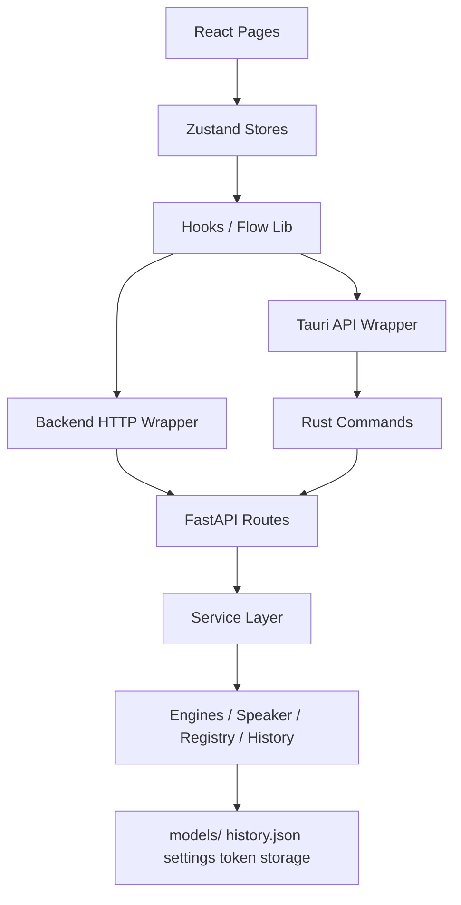
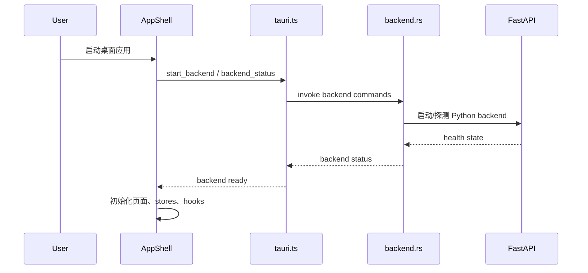
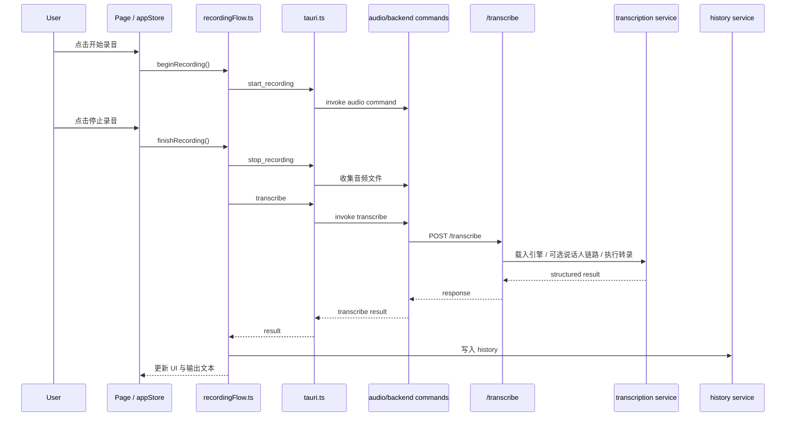
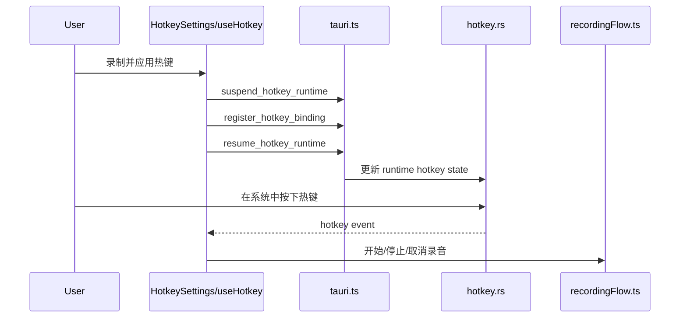
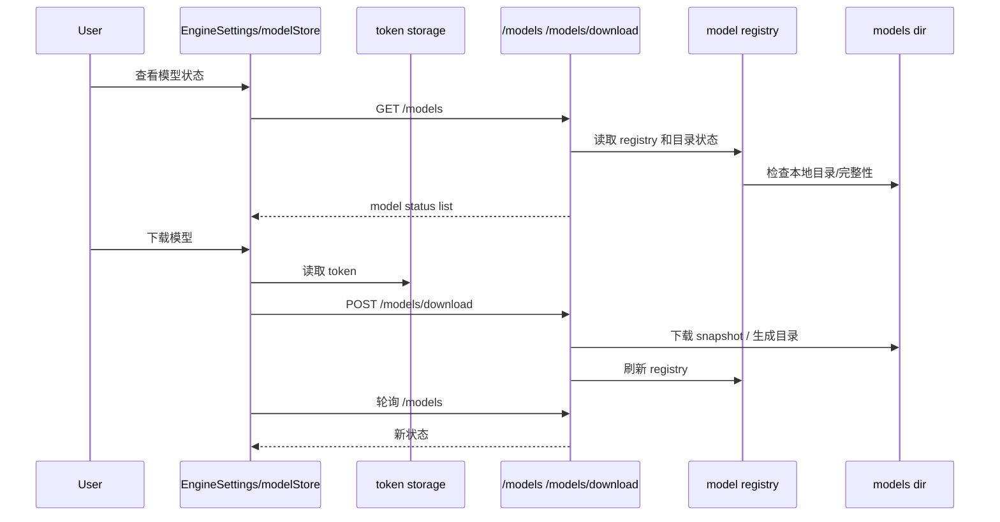
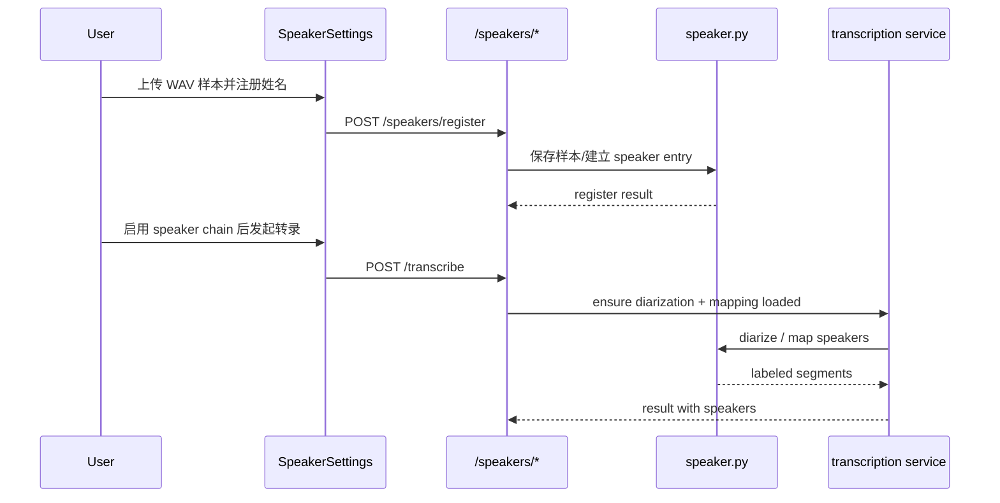

# VoiceScribe SPEC

## 2026-06-13 Phase C 可见处理流水线

本轮必须遵循 `docs/PIPELINE_STATE_DESIGN.md`：

- 桌面主链通过 `defer_text_processing=true` 获取原始 ASR 结果，再调用独立 `/text/process`。
- `appStore.pipeline` 是主窗口和 Overlay 的唯一可见阶段状态源。
- raw Profile 必须跳过独立处理请求和 `polishing` 可见状态。
- `/transcribe` 默认行为保持兼容，旧调用方不传 defer 字段时仍可获得组合结果。
- 独立处理请求失败必须本地构造 fallback 结果，继续输出和持久化原始转写。
- 不得用延时器或估算状态伪造 `polishing`。

## 2026-06-13 文本处理 Provider 就绪探测

本轮必须遵循 `docs/PROVIDER_READINESS_DESIGN.md`：

- canonical readiness 由后端 `TextProcessingService` 产生。
- 探测不得启动 Claude/Codex 任务或发送样本文本。
- OpenAI-compatible 仅通过短超时 `/models` 请求核对 endpoint 与配置模型。
- 单个 Provider 探测失败不得导致整个探测请求失败。
- 不返回完整命令路径、原始 endpoint 响应、用户文本或凭据。

## 2026-06-13 FastAPI Lifespan 迁移

- Single source of truth：FastAPI `lifespan` 是后端启动生命周期的唯一入口。
- 输入/输出契约：启动时仍调用现有 `preload_models()`；mock、禁用预加载、加载成功和加载失败行为保持不变；当前没有 shutdown 清理动作。
- Affected File List：`backend/server.py`、`backend/tests/test_pipeline_routes.py`、`docs/SPEC.md`、`docs/TEST.md`、`docs/BUGS.md`。
- Old-Logic Removal List：删除 `@app.on_event("startup")` 注册，不保留双重启动入口。
- Acceptance Criteria：mock backend 启动日志不再出现 `on_event is deprecated`；lifespan 自动化确认调用一次预加载入口；后端测试与 compileall 通过。
- Failure branches：单个模型预加载失败仍由 `preload_models()` 记录并继续启动；lifespan 不新增模型下载或用户目录缓存路径。

## 2026-06-14 文本润色任务取消

本轮必须遵循 `docs/TEXT_PROCESSING_CANCELLATION_DESIGN.md`：

- 后端 `TextProcessingTaskService` 是任务状态和取消事件的 canonical owner。
- cancelled 是独立终态，不得转换成 fallback。
- Claude/Codex CLI 必须终止子进程树；Codex SDK 必须调用 active turn 的 `interrupt()`。
- 桌面端取消后不得输出或写入 history。
- 同步 `/text/process` 保留兼容，但桌面 polishing 主链迁移到 task API。
- 不修改模型目录、模型 registry 或下载行为。

## 2026-06-14 本地 Style Profiles

本轮必须遵循 `docs/STYLE_PROFILES_DESIGN.md`：

- `AppSettings.styleProfiles` 和 `activeStyleProfileId` 是本地 Style 定义与选择的 canonical owner。
- 后端只验证和应用当前请求携带的 Style，不单独持久化定义。
- 自定义 instructions 只能影响写作风格，不能覆盖安全、忠实和 no-tool 规则。
- result/history 只保存 Style ID 与名称，不保存 instructions。
- 不修改 Provider 配置、模型 registry、模型路径或下载行为。

## 2026-06-14 Style Profile 快捷切换

本轮必须遵循 `docs/STYLE_PROFILE_QUICK_SWITCH_DESIGN.md`：

- `appStore.selectStyleProfile()` 是所有 Style 选择入口，负责同步 base Profile 与持久化。
- `appStore.cycleStyleProfile()` 负责固定循环顺序。
- `Layout.tsx` 只展示并触发 action，不自行修改 settings。
- 活跃 pipeline 期间快捷切换必须禁用。
- 本轮不修改 Rust hotkey、tray、模型路径或下载行为。

更新时间：2026-04-02  
文档定位：实施交接文档，描述当前工作树中的真实技术实现、模块边界、接口契约、运行链与失败分支。  
配套文档：
- `docs/PRD.md`
- `docs/TEST.md`
- `docs/BUGS.md`

## 1. 文档目的与范围

### 1.1 编写目的

本文件不是理想化技术蓝图，而是面向后续 AI / 开发继续修改当前仓库时的实施交接文档。它要回答四类问题：

- 当前系统真实是怎么跑起来的
- 哪些模块负责 canonical state
- 请求、响应、持久化对象和运行时状态遵守什么契约
- 哪些失败分支已经收口，哪些仍是已知缺口

### 1.2 覆盖范围

本文件覆盖当前仍在维护的真实能力：

- React 前端页面、状态和流程层
- Tauri 命令层与 Windows 桌面能力
- Python FastAPI 路由层与服务层
- 模型目录、模型注册表、历史记录、设置、token
- 热键、录音、转录、说话人、实时流式、历史记录主链

### 1.3 非覆盖范围

本文件不覆盖：

- 云端产品化方案
- Web 版架构
- 用户体系、多人协作、权限系统
- 当前工作树中不存在的未来重构方案

## 2. 系统上下文

### 2.1 总体上下文

VoiceScribe 是一个基于 Tauri 的 Windows 桌面语音转写应用。系统由三层共同组成：

- 前端 React：承接用户交互、状态展示、录音流程编排
- Tauri / Rust：承接桌面能力、音频录制、全局热键、token 安全存储、后端进程控制
- 后端 FastAPI / Python：承接模型状态、下载、加载、转录、说话人链路、历史记录持久化

### 2.2 总体架构图



### 2.3 单一事实源

当前系统的 canonical state 分布如下：

| 领域 | 单一事实源 |
|---|---|
| 前端设置态 | `tauri-app/src/stores/appStore.ts` |
| 前端模型状态列表 | `tauri-app/src/stores/modelStore.ts` + `/models` 响应 |
| 热键正式结构 | `tauri-app/src/types/index.ts` 中的 `HotkeyBinding` |
| 热键运行时注册状态 | Rust `hotkey.rs` 运行时状态 |
| 后端健康状态 | Tauri backend command + `/health` |
| 模型目录真实状态 | `<repo>/models/` 与 `backend/services/model_registry.py` |
| 模型可运行性 | `backend/server.py` + service/runtime probe 判定 |
| 历史记录 | `backend/services/history_service.py` 管理的 `history.json` |
| token | Windows Credential Manager，通过 Tauri `credentials.rs` 管理 |

## 3. 代码影响范围

### 3.1 前端页面层

- `tauri-app/src/AppShell.tsx`
- `tauri-app/src/components/Layout.tsx`
- `tauri-app/src/pages/EngineSettings.tsx`
- `tauri-app/src/pages/GeneralSettings.tsx`
- `tauri-app/src/pages/HotkeySettings.tsx`
- `tauri-app/src/pages/SpeakerSettings.tsx`
- `tauri-app/src/pages/RealtimeTranscriptionPage.tsx`
- `tauri-app/src/pages/HistoryPage.tsx`
- `tauri-app/src/pages/VocabularySettings.tsx`

### 3.2 前端状态 / 流程层

- `tauri-app/src/stores/appStore.ts`
- `tauri-app/src/stores/modelStore.ts`
- `tauri-app/src/lib/recordingFlow.ts`
- `tauri-app/src/hooks/useHotkey.ts`
- `tauri-app/src/hooks/useTrayEvents.ts`
- `tauri-app/src/hooks/useBackendConnection.ts`
- `tauri-app/src/api/backend.ts`
- `tauri-app/src/api/tauri.ts`
- `tauri-app/src/types/index.ts`

### 3.3 Tauri / Rust 层

- `tauri-app/src-tauri/src/lib.rs`
- `tauri-app/src-tauri/src/commands/backend.rs`
- `tauri-app/src-tauri/src/commands/audio.rs`
- `tauri-app/src-tauri/src/commands/hotkey.rs`
- `tauri-app/src-tauri/src/commands/text_input.rs`
- `tauri-app/src-tauri/src/commands/credentials.rs`

### 3.4 后端层

- `backend/server.py`
- `backend/services/transcription_service.py`
- `backend/services/model_catalog.py`
- `backend/services/model_registry.py`
- `backend/services/history_service.py`
- `backend/diarization/speaker.py`
- `backend/engines/*.py`
- `backend/config.py`
- `backend/runtime_probe.py`

### 3.5 持久化与运行时对象

- `models/`
- `models/voicescribe_models.json`
- `history.json`
- `voicescribe-settings.json`
- Windows Credential Manager
- 热键共享日志文件

## 4. 关键运行链

### 4.1 应用启动链



关键点：

- 前端真正可用前依赖 backend ready。
- `AppShell.tsx` 同时初始化后端连接、热键 hook、tray events、overlay bridge。
- 启动通过不代表所有模型已可运行，只代表基础桌面壳和后端已起来。

### 4.2 主窗口录音转录链



关键点：

- 录音和转录是同一条业务主链，不能把页面状态更新误当成成功。
- 转录结果后续还会影响实时页、历史页和桌面文本输出。
- 说话人链路是可选增强，不应反向拖垮普通 ASR 主链。

### 4.3 热键录音链



关键点：

- 设置页录制态和运行态监听必须共享 `HotkeyBinding`。
- 热键 Apply 的核心风险点在 register/suspend/resume 恢复链。
- 冷启动时还存在 persisted binding 自动恢复链。

### 4.4 模型下载与状态刷新链



关键点：

- 页面看到的可用性来自 `/models`，不是前端自己推断。
- 对特殊模型，目录存在不等于可用。
- 失败下载不能污染后续状态为“已下载”。

### 4.5 说话人注册与转录链



关键点：

- speaker registry 和 diarization runtime 是两层能力，不能混为一体。
- speaker page 能注册成功，不代表 runtime 已可真正推理。

## 5. 模块设计

### 5.1 前端页面层

| 页面 | 职责 | 输入 | 输出 | 当前状态 |
|---|---|---|---|---|
| `EngineSettings.tsx` | 引擎选择、模型状态、下载/删除/预加载 | 用户操作、model store、token | 模型请求、状态展示 | 已实现主链 |
| `GeneralSettings.tsx` | 通用设置、输出模式、录音相关设置 | app settings | 设置更新 | 已实现主链 |
| `HotkeySettings.tsx` | 热键录制、保存、Apply | 键盘事件、hotkey binding | 调用 suspend/register/resume | 已实现，仍有 runtime 问题 |
| `SpeakerSettings.tsx` | 说话人样本注册和删除 | 文件、姓名、模型选择 | speaker CRUD 请求 | 已实现主链 |
| `RealtimeTranscriptionPage.tsx` | 展示流式片段和摘要 | app store realtime state | 页面展示 | 已实现主链 |
| `HistoryPage.tsx` | 历史列表、复制、删除、导出 | history data | 用户操作回传 | 已实现主链 |
| `VocabularySettings.tsx` | 热词和文本优化设置 | 热词、AI 优化开关 | 设置更新 | 已实现主链 |

页面层边界：

- 页面只负责展示和触发 action，不定义正式数据契约。
- 页面可以聚合用户流程，但不能绕开 store / api 直接发明新状态结构。

### 5.2 前端状态层

#### `appStore.ts`

- 职责：前端应用主状态入口
- 上游：页面、hooks、recording flow
- 下游：页面展示、后续 invoke/http 请求
- 输入：设置变更、实时状态、录音状态、后端状态
- 输出：统一设置对象、运行态对象、action
- 持久化影响：设置文件、历史写回链上的部分用户选择

#### `modelStore.ts`

- 职责：模型列表、下载状态轮询、模型操作封装
- 上游：EngineSettings
- 下游：`backend.ts` `/models*`
- 输入：refresh/download/delete/load 请求
- 输出：模型状态列表、下载中状态
- 持久化影响：间接影响 registry 与模型目录

状态层边界：

- 前端 store 保存 UI 视角状态，不替代后端的真实可用性判定。
- 模型可用性、说话人 runtime 可用性等最终仍以后端为准。

### 5.3 前端流程与 hook 层

#### `recordingFlow.ts`

- 职责：开始录音、停止录音、取消录音、转录完成后写回
- 输入：用户操作、当前设置、热键事件
- 输出：录音状态更新、转录结果、历史记录、文本输出
- 对外依赖：`tauri.ts`、`appStore.ts`
- 风险：该文件是前端主业务编排点，变更容易影响录音、实时页、历史、输出

#### `useHotkey.ts`

- 职责：热键 runtime 恢复、前端事件桥接、trace 日志串联
- 输入：store 中的 `hotkeyBinding`、Tauri 事件
- 输出：register/suspend/resume 调用、录音触发事件
- 对外依赖：`tauri.ts`、`recordingFlow.ts`
- 风险：冷启动恢复、Apply 恢复、单键特例

#### `useBackendConnection.ts`

- 职责：启动时连接后端、轮询/确认后端状态
- 输入：AppShell 启动
- 输出：backend ready / backend error 状态

### 5.4 Tauri / Rust 命令层

| 文件 | 职责 | 输入 | 输出 | 说明 |
|---|---|---|---|---|
| `backend.rs` | 后端进程启动/停止/探测 | frontend invoke | backend status / process result | dev 与 packaged 路径解析都在这里 |
| `audio.rs` | 音频录制命令 | start/stop/cancel | 录音文件路径或状态 | 直接承接录音链 |
| `hotkey.rs` | 全局热键注册与事件 | binding、runtime control | runtime state、事件、日志 | Windows 真实行为关键点 |
| `text_input.rs` | 外部文本输出 | text/output mode | 输出结果 | 桌面集成能力 |
| `credentials.rs` | token 安全存储 | key/category/model | token 读写结果 | Windows Credential Manager 封装 |

命令层边界：

- 向前端暴露稳定 invoke 契约。
- 不承担跨模块产品级编排。
- 对 Windows 能力的失败要尽量返回可诊断结果。

### 5.5 FastAPI 路由层

主要职责：

- 解析 HTTP 入参
- 返回统一响应/错误
- 调用 service 层
- 维护高层编排入口

当前风险：

- `backend/server.py` 是高风险中心文件。
- 模型管理、转录、历史、说话人、流式逻辑过多集中在此。
- 后续新增复杂规则前，应优先评估是否下沉到 `services/`。

### 5.6 服务层

#### `transcription_service.py`

- 职责：引擎复用、加载、转录调度、diarization 加载收口
- 输入：转录请求、模型选择、speaker chain 选项
- 输出：转录结果或明确错误
- 下游依赖：各 engine、`speaker.py`

#### `model_registry.py`

- 职责：模型 registry 读写、自愈、路径校正
- 输入：模型路径、registry 条目、目录状态
- 输出：registry 结果
- 风险：错误 registry 会导致假可用状态

#### `model_catalog.py`

- 职责：定义引擎、模型、兼容性矩阵
- 输入：engine/model 查询
- 输出：model metadata

#### `history_service.py`

- 职责：history.json 读写、删除、清空、导出
- 输入：转录结果对象
- 输出：历史记录列表与文件落地

#### `speaker.py`

- 职责：speaker sample 管理、diarization 加载、runtime probe
- 输入：说话人样本、模型名、token/本地模型目录
- 输出：speaker list、diarization runtime、异常

## 6. 数据模型与持久化对象

### 6.1 `HotkeyBinding`

正式结构：

```ts
type HotkeyBinding = {
  keys: number[]
  display: string
}
```

约束：

- `keys.length` 只能是 `1` 或 `2`
- `keys` 必须去重并排序
- 左右键位差异必须保留
- 不恢复旧的 `primaryCode / modifiers` 结构为正式主链

### 6.2 `AppSettings`

当前正式设置至少包含：

- 当前引擎与模型选择
- 语言
- 说话人链路开关
- 输出模式
- 热词
- AI 文本优化开关
- 流式与摘要开关
- 保留音频开关
- 自动启动
- `hotkeyBinding`

约束：

- 新设置字段必须同步检查前端类型、持久化、默认值和相关页面。

### 6.3 `HistoryRecord`

任务级历史对象，至少承载：

- 转录正文
- 可选摘要
- 引擎与模型信息
- 可选音频路径
- 可选说话人片段
- 时间戳和任务级标识

约束：

- 历史是任务级记录，不按说话人拆成多条主记录。
- 音频导出能力受 `retainAudio` 控制。

### 6.4 模型状态对象

模型状态至少表达：

- `available`
- `downloadable`
- `requires_token`
- `downloading`
- `loaded`
- `size_bytes`
- `downloaded_bytes`
- `error`

约束：

- “目录存在”不等于“模型可用”。
- gated 模型不能只按下载请求成功来判定为可运行。
- 特殊模型允许有专属完整性检查。

### 6.5 模型目录与注册表

主根目录：

- `<repo>/models/`

关键对象：

- `models/voicescribe_models.json`
- `models/huggingface/`
- `models/diarization/`
- 其他运行时缓存目录

约束：

- 主路径不切回用户目录作为默认缓存语义。
- 下载、删除、校验都要围绕项目内路径完成。

### 6.6 token 存储

当前 token 不直接放在工作树，而是通过 Tauri 写入 Windows Credential Manager。

约束：

- 页面发起下载时通过 Tauri 读取 token。
- token 不进入文档、registry 或普通 settings 文件。

## 7. 接口定义

### 7.1 前端到 Tauri invoke 契约

| 命令 | 输入 | 输出 | 说明 |
|---|---|---|---|
| `start_backend` | 无或 backend config | backend start result | 启动 Python backend |
| `stop_backend` | 无 | stop result | 停止 backend |
| `backend_status` | 无 | running/ready/status detail | 前端启动期依赖 |
| `register_hotkey_binding` | `HotkeyBinding` | register result | 更新 runtime binding |
| `suspend_hotkey_runtime` | 无 | suspend result | 设置页录制前调用 |
| `resume_hotkey_runtime` | 无 | resume result | Apply 后恢复 |
| `start_recording` | audio config | recording state | 开始录音 |
| `stop_recording` | 无 | audio file / state | 停止录音 |
| `cancel_recording` | 无 | cancel result | 取消录音 |
| `transcribe` | audio path + settings | transcribe result | 录音主链入口 |
| `output_text` | text + output mode | output result | 文本输出到目标位置 |
| token 读写命令 | category/engine/model | token or write result | 供模型下载使用 |

契约要求：

- 命令名、字段名必须与 `tauri-app/src/api/tauri.ts` 保持一致。
- 热键命令应保留 trace 能力。
- 返回错误必须区分“无法调用”和“调用成功但业务失败”。

### 7.2 前端到 Backend HTTP 契约

| 接口 | 方法 | 输入 | 输出 | 用途 |
|---|---|---|---|---|
| `/health` | GET | 无 | backend health | 启动就绪判断 |
| `/engines` | GET | 无 | engine catalog | 引擎页初始化 |
| `/models` | GET | category/engine/model 可选过滤 | model status list | 模型状态刷新 |
| `/models/download` | POST | model + token | download result | 下载模型 |
| `/models/delete` | POST | model path/id | delete result | 删除模型 |
| `/load` | POST | engine/model selection | load result | 预加载 |
| `/transcribe` | POST | transcribe payload | structured result | 主转录入口 |
| `/stream` | WS/stream | audio chunks | realtime entries | 实时转录 |
| `/history` | GET/POST/DELETE | history params | history result | 历史读写 |
| `/summary` | POST | summary input | summary result | AI 摘要 |
| `/speakers/register` | POST | name + wav | register result | 注册说话人 |
| `/speakers` | GET/DELETE | query/id | speaker list/result | speaker CRUD |

契约要求：

- 错误应显式区分依赖缺失、目录不完整、token 缺失、运行时失败。
- 后端不得把“可下载”误报成“可运行”。

## 8. 失败分支与恢复策略

### 8.1 录音链失败分支

- 后端未启动：前端需阻止直接进入成功态。
- 录音过短：返回明确提示，避免长等待。
- 模型未加载或不可用：返回可理解错误。
- 说话人链失败：优先回退纯 ASR，而非整体崩掉。

### 8.2 热键链失败分支

- 冷启动恢复失败：需可从 trace 看出卡在 bind/register/runtime 哪一段。
- Apply 后恢复慢：需能定位 suspend/resume 间耗时。
- 单键路径特例：不能和组合键路径共享错误假设。

### 8.3 模型链失败分支

- 下载失败但残留目录：不得显示为可用。
- 目录完整但依赖缺失：不得显示为真实可运行。
- token 缺失或 gated repo 未授权：需返回明确错误。

### 8.4 桌面能力失败分支

- 托盘/Overlay/文本注入失败：需保留主窗口回退路径。
- 自动启动未生效：需落到人工验收与平台差异排查。

## 9. 日志、诊断与可观测性

当前关键可观测对象：

- backend start/stop/status
- hotkey register/suspend/resume/trigger
- model download/status/load
- transcribe request/result/error
- speaker load/runtime error

当前要求：

- 热键链应保留 trace_id 和时间线。
- 模型状态错误要能从 `/models` 直接反映到前端。
- 高风险 Windows 行为不能只留下“失败”而无阶段定位信息。

## 10. 实施约束

### 10.1 文档约束

- 后续改代码前优先读 `PRD/SPEC/TEST/BUGS`。
- 不再依赖已删除旧归档作为工作树入口。

### 10.2 结构约束

- 模型和缓存主路径保持在 `<repo>/models/`。
- `backend/server.py` 新增复杂业务前，优先评估是否应下沉 service。
- 页面不发明新正式数据结构，正式契约统一回到类型、接口和持久化对象。

### 10.3 质量约束

- 不把构建通过说成完成。
- 不把路径存在说成模型可用。
- 不在未人工验收前宣称桌面体验已完成。
- 不在文档或普通配置文件中泄露 token。

## 11. 测试与验收映射

文档分工：

- `docs/PRD.md`：定义功能验收口径
- `docs/TEST.md`：记录已执行测试和待人工验收
- `docs/BUGS.md`：记录未收口问题

映射规则：

- 变更某个功能模块时，应同步检查 `PRD` 对应验收项。
- 变更接口或数据契约时，应至少记录编译/构建/静态验证。
- 涉及 Windows 桌面行为时，应明确是否已做真机人工验收。

## 12. 当前未收口点

高优先级：

- 冷启动 `Right Alt` 不触发
- 热键 Apply 后恢复慢
中优先级：

- `3D-Speaker` 真实验收

低优先级 / 后续整理：

- 持续收窄 `backend/server.py`
- 进一步把模型状态校验从通用规则扩展到更多特殊模型

## 13. Phase A：统一文本处理运行时

本阶段正式规格见 `docs/TEXT_PROCESSING_DESIGN.md`。

关键约束：

- 后端 `TextProcessingService` 是 Provider/Profile 支持矩阵的单一事实源。
- 前端设置只保存用户选择，不实现 Provider 业务逻辑。
- `TranscribeResult.text` 是最终输出文本，`TranscribeResult.raw_text` 是原始 ASR 文本。
- CLI 输入通过 stdin 传递，不把原始转写放入 argv。
- Provider 失败统一回退原文，并通过结构化结果与 warnings 透传。
- 历史记录同步保存原文、最终文本和文本处理元数据。
- 新业务逻辑不继续堆叠到 `backend/server.py`。

## 14. Phase B：上下文感知文本处理

本阶段正式规格见 `docs/CONTEXT_AWARE_DESIGN.md`。

关键约束：

- 录音开始时由 Rust 保存目标窗口快照，后续输出和上下文读取共享该事实源。
- 首轮只透传应用类别和可执行文件名，不读取选区、正文、完整标题、完整路径、PID 或 HWND。
- 上下文失败不得阻断录音、转写、文本处理或输出。
- 上下文只影响文本风格，不覆盖显式 Profile，不允许 Provider 执行口述任务。

## 15. Phase D：独立只读 Agent 入口

本阶段正式规格见 `docs/AGENT_ENTRY_DESIGN.md`。

关键约束：

- 后端 `AgentTaskService` 是任务生命周期的单一事实源。
- Agent 与 `TextProcessingService`、录音 pipeline、外部文本输出和 history 隔离。
- 工作目录固定为 `PROJECT_ROOT`，客户端不能提交任意目录。
- Codex CLI/SDK 使用只读沙箱且拒绝授权；Claude Code 首轮禁用工具。
- Agent Provider 环境必须继续把模型和缓存指向 `<repo>/models/`。
- `server.py` 只增加薄路由，Agent 业务规则放入独立 service。
